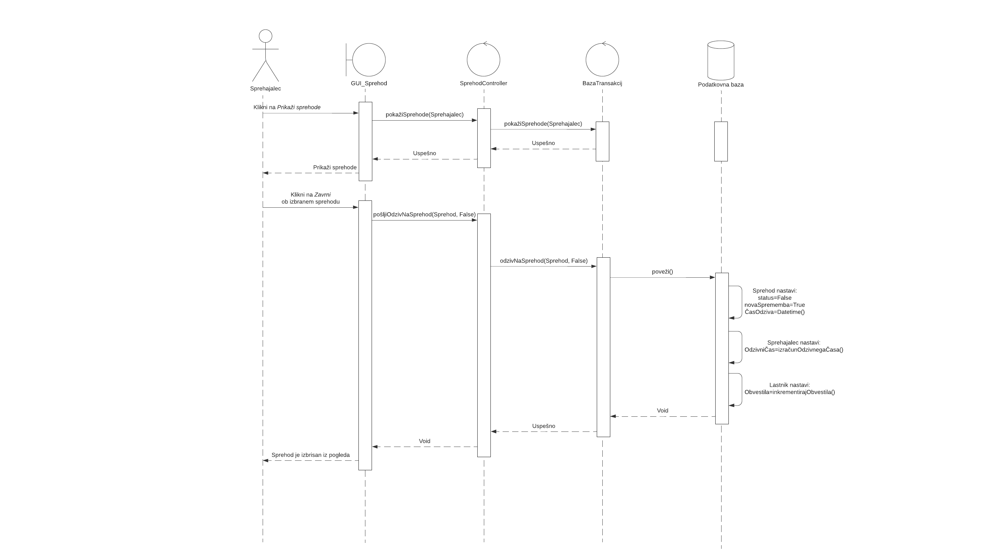
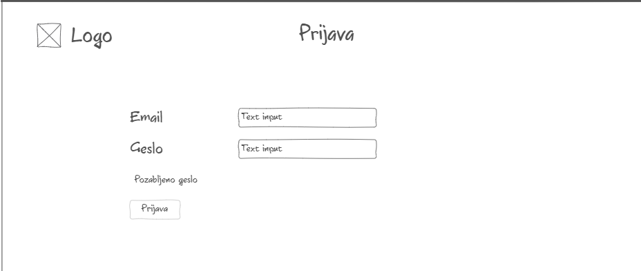

# 1. Načrt sistema

|                             |                                                         |
| :-------------------------- | :------------------------------------------------------ |
| **Naziv projekta**          | Dog Walkers                             |
| **Člani projektne skupine** | Martin Štrekelj, Mimi Klinec, Luka Bratina, Ilija Tavchioski, Tim Draksler |
| **Kraj in datum**           | 18. 4. 2021                                   |

## 1.1. Povzetek

V dokumentu je predstavljen celoten načrt bodočega sistema. Načrt je sestavljen iz načrta arhitekture sistema, načrta strukture oziroma razrednega diagrama, opisa razredov (ter njihovih atributov in metod) in načrtov obnašanja. Arhitekturo smo načrtovali po vzorcu MVC in jo predstavili z logičnim pogledom. Za predstavitev podsistemov smo uporabili komponentne diagrame. Vključen je tudi razvojni pogled, kjer je delo okvirno razdeljeno med člani skupine. Za prikaz strukture sistema smo uporabili razredni diagram in ga podprli s tekstovnimi opisi posameznih razredov. Pri načrtovanju razredov smo bili pozorni, da smo uporabljali dobre načrtovalske vzorce kot so Singleton, Fasada in Template. Ključen del načrta pa je načrt obnašanja, kjer je s pomočjo diagramov zaporedja in psevdokode prikazana dinamika sistema.

## 1.2. Načrt arhitekture

### 1.2.1. Logični Pogled


### 1.2.2. Komponentni diagrami

#### 1.2.2.1. Podsistem Avtentikacija


#### 1.2.2.2. Podsistem Profil


#### 1.2.2.3. Podsistem Oglas


#### 1.2.2.4. Podsistem Sprehod


### 1.2.3. Razvojni Pogled


## 1.3. Načrt strukture

### 1.3.1. 1.3.1 Razredni diagram


## 1.4. Opis razredov

Za vsak objekt je podan kratek opis v **naravnem jeziku**, **atributi** v formatu `atribut : podatkovni tip`
(V kolikor je atribut poljuben(ni obvezen) je za imenom atributa oziroma pred dvopičjem (':') postavljen `?` npr `attr?: integer`. Če je za atribut dodana še kakšna posebnost ali značilnost je to pripisano v `()` npr `attr: boolean (default:false)`) ter opis vseh **nesamoumevnih metod**,
ki so v tabelarični obliki v formatu: **ime metode, vhodni podatki, izhodni rezultat, opis** (Vhodni parametri so definirani po istem formatu kot atributi).
Kot samoumevno metodo štejemo vse t.i. getterje in setterje. (npr. `pridobiId()`, `nastaviID()`).

### 1.4.1. Mejni razredi `<<Boundary>>`

#### 1.4.1.1. GUI_Iskalnik

Razred GUI_Iskalnik se uporablja za prikaz seznama oglasov uporabniku. Omogoča tudi filtriranje oglasov.

##### 1.4.1.1.1. Atributi

- `Oglasi: Oglas[]`

Filter:

- `Ime?: String`
- `Pasma?: Pasma`
- `MaxOdzivniČas?: Datetime`
- `Lokacija?: String`
- `MinOcena?: float`
- `samoPriljubljeni?: boolean`
- `samoIzkušeni?: boolean`

##### 1.4.1.1.2. Metode

|Opis metode   | Vhodni podatki   |Rezultat   |Opis   |
|:---:|:---:|:---:|:---|
|`filtriraj()`   | izbireFiltra: Object  | void | Metoda prejme vsebino filtra in pošlje zahtevek za filtriranje na strežnik.|
|`izberiOglas(Oglas)`   | Oglas: integer | void | Metoda prejme id Oglasa pošlje zahtevek za prikaz strani oglasa na strežnik. |
|`izbrišiOglas(Oglas)`   | Oglas: integer | void | Metoda prejme id Oglasa pošlje zahtevek za izbris oglasa strežnik. |

#### 1.4.1.2. GUI_Oglas

Razred GUI_Oglas se uporablja pri prikazu in interakciji uporabnika s posameznim oglasom.

##### 1.4.1.2.1. Atributi

- `Oglas: Oglas`
- `Pes: Pes`

##### 1.4.1.2.2. Metode

|Opis metode   | Vhodni podatki   |Rezultat   |Opis   |
|:---:|:---:|:---:|:---|
|`pošljiPonudbo(Oglas, Pes)`   | Oglas: integer, Pes: integer  | void | Metoda prejme id Oglasa in id Psa in pošlje zahtevek za pošiljanje ponudbe na strežnik.|

#### 1.4.1.3. GUI_Sprehod

Razred GUI_Sprehod se uporablja za prikaz posameznega sprehoda uporabniku. Glede na uporabniške pravice se uporablja tudi pri potrjevanju ponudbe za sprehod, pošiljanju ocen, prijavljanje kršitev in dodajanju med priljubljene.

##### 1.4.1.3.1. Atributi

- `Sprehodi: Sprehod[];`

##### 1.4.1.3.2. Metode

|Opis metode   | Vhodni podatki   |Rezultat   |Opis   |
|:---:|:---:|:---:|:---|
|`pošljiPrijavoKršitve(Sprehod, kršitev)`   | Sprehod: integer, Kršitev: string  | void | Metoda prejme id Sprehoda in kršitev v tekstualni obliki in pošlje zahtevek za prijavljanje kršitve na strežnik.|
|`pošljiPriljubljenega(Sprehod)`   | Sprehod: integer  | void | Metoda prejme id Sprehoda in pošlje zahtevek za dodajanje priljubljenega na strežnik.|
|`pošljiOceno(Sprehod, ocena)`   | Sprehod: integer, Ocena: Float  | void | Metoda prejme id Sprehoda in oceno, ki je vrednost na intervalu med [0-5] in pošlje zahtevek za dodajanje ocene na strežnik.|
|`pošljiOdzivNaSprehod(Sprehod, odziv)`   | Sprehod: integer, Odziv: boolean  | void | Metoda prejme id Sprehoda in odziv, ki je vrednost boolean in pošlje zahtevek za pošiljanje odziva na sprehod na strežnik.|
|`izberiSprehod(Sprehod)`   | Sprehod: integer | odgovor: Response | Metoda prejme id Sprehoda in pošlje zahtevek za prikaz strani sprehoda na strežnik.|

#### 1.4.1.4. GUI_UstvarjanjeOglasa

Razred GUI_UstvarjanjeOglasa se uporablja za prikaz pogleda ob ustvarjanju oglasa uporabniku (sprehajalcu, izkušenemu sprehajalcu).

##### 1.4.1.4.1. Atributi

- `Kraj: String;`
- `Opis: String`
- `Začetek: DateTime`
- `Konec: DateTime`
- `Sprehajalec: Sprehajalec`
- `PriljublenePasme?: Pasma[]`

##### 1.4.1.4.2. Metode

|Opis metode   | Vhodni podatki   |Rezultat   |Opis   |
|:---:|:---:|:---:|:---|
|`predogledOglasa()`   | / | void | Metoda pod obrazcem za ustvarjanje obraza prikaže vpisane podatke iz obrazca v končno obliko (naredi se predogled končnega izdelka).|
|`pošljiObrazec(Oglas)`   | / | void | Metoda prejme vsebino obrazca, jo validira ter pošlje zahtevek za ustvarjanje oglasa na strežnik. V kolikor vsebina ni primerna se zahtevek ne pošlje, vendar se uporabnika obvesti o pomanjkljivostih.|
|`ponastaviObrazec()`   | / | void | Metoda nastavi vrednosti obrazca na prvotne vrednosti. |

#### 1.4.1.5. GUI_Prijava

Razred GUI_Prijava se uporablja pri prikazu in interakciji s prijavnim obrazcem.

##### 1.4.1.5.1. Atributi

- `Email: String`
- `Geslo: String`

##### 1.4.1.5.2. Metode

|Opis metode   | Vhodni podatki   |Rezultat   |Opis   |
|:---:|:---:|:---:|:---|
|`pošljiObrazec(Email, Geslo)`   | Email: string, Geslo: string | Uporabnik | Metoda prejme Email in Geslo, ju validira ter pošlje zahtevek za prijavo na strežnik. V kolikor vsebina ni primerna se zahtevek ne pošlje, vendar se uporabnika obvesti o pomanjkljivostih.|

#### 1.4.1.6. GUI_Registracija

Razred GUI_Registracija se uporablja pri prikazu in interakciji z registracijskim obrazcem.

##### 1.4.1.6.1. Atributi

- `Ime: String`
- `Geslo: String`
- `Email: String`
- `GSM?: Integer`
- `Vloga: TipUporabnikaEnum`

Atribut `Vloga` je tipa TipUporabnikaEnum (glej `Uporabnik`). Razpoložljivi opciji/izbiri sta zgolj 'Lastnik' in 'Sprehajalec'.

##### 1.4.1.6.2. Metode

|Opis metode   | Vhodni podatki   |Rezultat   |Opis   |
|:---:|:---:|:---:|:---|
|`pošljiObrazec(Uporabnik)`   | Uporabnik: Object | Uporabnik | Metoda prejme vsebino obrazca v obliki objekta, vsebino validira ter pošlje zahtevek za registracijo na strežnik. V kolikor vsebina ni primerna se zahtevek ne pošlje, vendar se uporabnika obvesti o pomanjkljivostih.|
|`ponastaviObrazec()`   | / | void | Metoda nastavi vrednosti obrazca na prvotne vrednosti. |

#### 1.4.1.7. GUI_Profil

Razred GUI_Profil se uporablja pri prikazu in urejanju uporabniškega profila. Pogled se razlikuje glede na vrsto uporabnika.

##### 1.4.1.7.1. Atributi

Uporabnik:

- `Ime: String`
- `Geslo: String`
- `Email: String`
- `GSM?: Integer`

Pes: (Na voljo le če je uporabnik tipa 'Lastnik')

- `Ime: String`
- `Spol: boolean`
- `Pasma: integer (Id Pasme)`

##### 1.4.1.7.2. Metode

|Opis metode   | Vhodni podatki   |Rezultat   |Opis   |
|:---:|:---:|:---:|:---|
|`pošljiObrazecUporabnik(Uporabnik)`   | Uporabnik: Object | Uporabnik | Metoda prejme vsebino obrazca v obliki objekta, vsebino validira ter pošlje zahtevek za registracijo na strežnik. V kolikor vsebina ni primerna se zahtevek ne pošlje, vendar se uporabnika obvesti o pomanjkljivostih.|
|`pošljiObrazecPes(Pes)`   | Pes: Object | Uporabnik | Metoda prejme vsebino obrazca v obliki objekta, vsebino validira ter pošlje zahtevek za registracijo na strežnik. V kolikor vsebina ni primerna se zahtevek ne pošlje, vendar se uporabnika obvesti o pomanjkljivostih.|
|`ponastaviObrazec()`   | / | void | Metoda nastavi vrednosti obrazca na prvotne vrednosti. |
|`zbrišiPsa(Pes)`   | Pes: Pes | void | Metoda pošlje zahtevek za izbris psa. |
|`zbrišiProfil(Uporabnik)`   | Uporabnik: Uporabnik | void | Metoda pošlje zahtevek za izbris uporabnika. |
|`pridobiPasme()`   | / | Pasme: [{id: idPasme, ime: imePasme}] | Metoda pošlje zahtevek za pridobitev vseh pasem. Metoda vrne seznam objektov Pasme s podatki o id pasme in imenu pasme |
|`odjava()`   | / | void | Metoda odjavi uporabnika iz aplikacije. |

#### 1.4.1.8. GUI_Aktivacija

Razred GUI_Aktivacija se uporablja pri prikazu in interakciji z aktivacijskim obrazcem.

##### 1.4.1.8.1. Atributi

- `Koda: String`
- `Uporabnik: Uporabnik`

##### 1.4.1.8.2. Metode

|Opis metode   | Vhodni podatki   |Rezultat   |Opis   |
|:---:|:---:|:---:|:---|
|`pošljiAktivacijskoKodo(Uporabnik, Koda)`   | Uporabnik: Uporabnik, Koda: string | void | Metoda prejme Kodo zahtevek za aktivacijo na strežnik.|

#### 1.4.1.9. API_GoogleCalendar

Gre za aplikacijski vmesnik **GoogleCalendar** do zunanjega sistema, ki omogoča ustvarjanje dogodkov. Dokumentacijo o aplikacijskem vmesniku najdete na: [CalendarAPI](https://developers.google.com/calendar/)

#### 1.4.1.10. API_Pasme

Gre za aplikacijski vmesnik **theDogsApi** do zunanjega sistema, ki vsebuje podatke o pasmah psov. Dokumentacijo o aplikacijskem vmesniku najdete na: [TheDogApi](https://docs.thedogapi.com/)

### 1.4.2. Entiteni razredi `<<Entity>>`

#### 1.4.2.1. Uporabnik

Z razredom Uporabnik predstavimo vse vrste uporabnikov, ki uporabljajo sistem. Uporablja načrtovalski vzorec [Template](https://refactoring.guru/design-patterns/template-method), kjer predstavlja abstrakten razred.

##### 1.4.2.1.1. Atributi

Objekt razreda **Uporabnik** ima sledeče atribute:

- `Id: Integer`
- `Ime: String`
- `Geslo: String`
- `Email: String (unique)`
- `GSM?: Integer`
- `Aktiviran: boolean | null (default: False)`
- `DatumUstvaritve: Datetime`
- `DatumSpremembe: Datetime`
- `DatumDeaktivacije: Datetime`
- `Tip: TipUporabnikaEnum;`

Atribut `Tip` je Podatkovni tip `TipUporabnikaEnum` je Enum, ki vsebuje štiri vrednosti, in sicer:

- Sprehajalec
- Izkušeni sprehajalec
- Lastnik
- Administrator

Atribut `Aktiviran` ima tri vrednosti, in sicer:

| Vrednost | Pomen |
|:---:|:---|
| False | Uporabnik ni (še) aktiviran. (Aktivacijo lahko potrdi s potrditvenim mailom glej `AuthController`) |
| True | Uporabnik je aktiviran. |
| null | Uporabnik je deaktiviran s strani Administratorja |

##### 1.4.2.1.2. Metode

Razred `Uporabnik` nima dodatnih posebnih metod.

#### 1.4.2.2. Administrator

Objekt razreda Administrator predstavlja uporabnika, ki sistem uporablja kot administrator. Razred uporablja načrtovalski vzorec [Template](https://refactoring.guru/design-patterns/template-method) in je generaliziran v razred Uporabnik.

##### 1.4.2.2.1. Atributi

Objekt razreda **Administrator** podeduje vse atribute **Uporabnika**, kjer je

- `Tip: 'Administrator'`

##### 1.4.2.2.2. Metode

Razred `Administrator` nima dodatnih posebnih metod.

#### 1.4.2.3. Sprehajalec

Objekt razreda Sprehajalec predstavlja sprehajalca. Razred uporablja načrtovalski vzorec [Template](https://refactoring.guru/design-patterns/template-method) in je generaliziran v razred Uporabnik.

##### 1.4.2.3.1. Atributi

Objekt razreda **Sprehajalec** podeduje vse atribute **Uporabnika**, kjer je

- `Tip: 'Sprehajalec'`

Poleg tega pa vsebuje še dodatne atribute:

- `OdzivniČas?: OdzivniČasEnum`
- `PovprečnaOcena?: float`
- `Indeks: float (default: 0)`
- `Ocene: Ocena[]`
- `Kršitve: Kršitev[]`
- `Oglasi: Oglas[] (limit: 5)`
- `ŠtSprehodov: integer(default: 0)`

Opis manj intuitivnih attributov:

- Atribut `OdzivniČas` tipa OdzivniČasEnum je določen v metodi `izračunOdzivnegaČasa`,
in vsebuje naslednje vrednosti.

| OdzivniČasEnum  | Omejitev   | Vrednost |
|:---:|:---:|:---:|
| 'Dnevno' |`OdzivniČas` < 1 Dan | **7** |
| 'TriDnevno' |`OdzivniČas` < 3 Dni | **5** |
| 'Tedensko' |`OdzivniČas` < 7 Dni | **3** |
| 'VečKotTeden' |`OdzivniČas` > 7 Dni | **1** |

- Atribut `PovprečnaOcena` je izračunano povprečje vseh `Ocen`, ki jih je sprehajalec prejel.
- Atribut `Indeks` je produkt `OdzivniČas` * `PovprečnaOcena` izračunan v metodi `izračunIndeksa()`, kjer se vrednost `OdzivniČas` določi po naslednji tabeli:

##### 1.4.2.3.2. Metode

|Opis metode   | Vhodni podatki   |Rezultat   |Opis   |
|:---:|:---:|:---:|:---|
|`izračunIndeksa()`   | /  | void  | Metoda prebere attributa `OdzivniČas` in `PovprečnaOcena`, izračuna produkt in nastavi attribut `Indeks` na izračunano vrednost. V kolikor je en izmed attributov nedefiniran, metoda ne nastavi nove vrednosti. |
|`izračunPovprečneOcene()`   | /  | void  | Metoda prebere vse `Ocene` iz njih vzame vrednost `Vrednost` in izračuna povprečno vrednost in jo nastavi atribut `PovprečnaOcena` na izračunano vrednost |
|`izračunOdzivnegaČasa()`   | /  | void  | Metoda prebere vse `Oglasi` iz njih pridobi `Sprehod` in iz `Sprehoda` vzame vrednost `ČasOdziva` (metoda upoštevo zgolj vrednosti `ČasOdziva`, ki so definirane). Med pridobljenimi odzivnimi časi izračuna povprečni čas in ga na podlagi zgornje tabele `OdzivniČasEnum` dodeli vrednost. |
|`povečajŠtSprehodov()`   | / | void  | Metoda inkrementira attribut `ŠtSprehodov`. V kolikor je vrednost `ŠtSprehodov` višja ali enaka 10 in `Tip` enak 'Sprehajalec' kliči metodo `povišajSprehajalca()` |
|`povišajSprehajalca()`  | / | void  | Metoda klonira vse vrednosti attributov (pred tem jih ponovno izračuna s uporabo metod) trenutne istance `Sprehajalec` in v nov Objekt `IzkušeniSprehajalec` (prav tako vse povezane `Oglase`, `Ocene` in `Kršitve` poveže na novo istanco) in izbriše trenutno istanco. |

#### 1.4.2.4. Izkušeni sprehajalec

Objekt razreda Izkušeni sprehajalec predstavlja sprehajalca, ki ima visoko povprečno oceno in nizek povprečni odzivni čas. Razred uporablja načrtovalski vzorec [Template](https://refactoring.guru/design-patterns/template-method) in je generaliziran v razred Uporabnik.

##### 1.4.2.4.1. Atributi

Objekt razreda **Sprehajalec** podeduje vse atribute **Uporabnika**, kjer je

- `Tip: 'Sprehajalec'`
- `Oglasi: Oglas[] (limit: 99)`

##### 1.4.2.4.2. Metode

Razred `Izkušeni sprehajalec` nima dodatnih posebnih metod.

#### 1.4.2.5. Lastnik

Objekt razreda Lastnik predstavlja lastnika (vsaj enega) psa. Razred uporablja načrtovalski vzorec [Template](https://refactoring.guru/design-patterns/template-method) in je generaliziran v razred Uporabnik.

##### 1.4.2.5.1. Atributi

Objekt razreda **Lastnik** podeduje vse atribute **Uporabnika**, kjer je

- `Tip: 'Lastnik'`
- `Psi: Pes[]`

##### 1.4.2.5.2. Metode

Razred `Lastnik` nima dodatnih posebnih metod.

#### 1.4.2.6. Pes

Objekt razreda Pes predstavlja lastnikovega psa. Razred je namenjen hranjenju informacij o psih.

##### 1.4.2.6.1. Atributi

- `Id: Integer`
- `Ime: String`
- `Opis?: String`
- `Spol: boolean`
- `Pasma_ime: String`
- `Temperament: String`
- `WikiPasmeUrl: String`
- `Višina: Integer`
- `Teža: Integer`
- `Sprehodi?: Sprehod[]`
- `Lastnik: Lastnik`

Atribut Spol ima dve vrednosti (boolean), in sicer:

| Vrednost | Pomen |
|:---:|:---:|
| False | Psička |
| True | Pes |

##### 1.4.2.6.2. Metode

Razred `Pes` nima dodatnih posebnih metod.

#### 1.4.2.7. Sprehod

V razredu Sprehod se hranijo potrjeni termini sprehodov. Posamezen objekt je sprehod, dogovorjen s strani posameznega lastnika in posameznega sprehajalca.

##### 1.4.2.7.1. Atributi

- `Id: integer`
- `Status: boolean | null (default: null)`
- `DatumKreiranja: Datetime`
- `ČasOdziva?: Datetime`
- `Oglas: Oglas`
- `Pes: Pes`
- `novaSprememba: boolean (default: True);`

Atribut `Status` ima tri različne opcije:

| Vrednost | Pomen |
|:---:|:---|
| null | Na sprehod še ni bilo dogovora |
| False | Sprehod je bil zavrnjen |
| True | Sprehod je bil sprejet |

##### 1.4.2.7.2. Metode

Razred `Sprehod` nima dodatnih posebnih metod.

#### 1.4.2.8. Ocena

Razred Ocena je namenjen hranjenju številskih ocen, ki jih po koncu sprehodov lastniki podajo sprehajalcem.

##### 1.4.2.8.1. Atributi

- `Id: Integer`
- `Vrednost: Float (interval: [0-5])`
- `Sprehajalec: Sprehajalec`

##### 1.4.2.8.2. Metode

Razred `Ocena` nima dodatnih posebnih metod.

#### 1.4.2.9. Kršitev

Razred Kršitev je namenjen hranjenju preko sistema prijavljenih kršitev. Podajo jih lahko lastniki glede sprehajalcev.

##### 1.4.2.9.1. Atributi

- `Id: Integer`
- `Vsebina: String`
- `Sprehajalec: Sprehajalec`

##### 1.4.2.9.2. Metode

Razred `Kršitev` nima dodatnih posebnih metod.

#### 1.4.2.10. Oglas

Objekt razreda Oglas hrani vse ključne podatke o sprehodu, ki ga oglašuje posamezen sprehajalec.

##### 1.4.2.10.1. Atributi

- `Id: Integer`
- `Sprehajalec: Sprehajalec`
- `Lokacija: String;`
- `ČasZačetka: Datetime`
- `ČasKonca: Datetime`

##### 1.4.2.10.2. Metode

Razred `Oglas` nima dodatnih posebnih metod.

### 1.4.3. Kontrolni razredi `<<Control>>`

#### 1.4.3.1. AuthController

Razred AuthController se uporablja pri uporabniških vstopih v sistem in splošni avtentikaciji. Uporabnikom glede na njihove pravice določi dostop do funkcionalnosti sistema.

##### 1.4.3.1.1. Metode

|Opis metode   | Vhodni podatki   |Rezultat   |Opis   |
|:---:|:---:|:---:|:---|
|`Registracija(Uporabnik)`   | Uporabnik: Uporabnik  | Odgovor: Response  | Metoda prejme objekt tipa Uporabnik (glej `GUI_Registracija`). Metoda očisti vhodne podatke, jih validira (regex pravilo za email, Ime ne vsebuje ne črkovnih znakov, preveri ali že obstaja Uporabnik s tem emailom). Metoda na podlagi Tip prejetega uporabnika ustvari ustreznega `Uporabnika` za `Geslo` pa shrani zgoščeno obliko vhodnega podatka. Nato metoda kliče `ustvariAktivacijskoKodo(Ime, DatumUstvaritve)`  in kodo  pošlje na Uporabnikov email naslov. Metoda vrne odgovor odjemalcu o uspešni/neuspešni izvedbi. V odgovoru se pošlje tudi informacija o registriranem uporabniku. |
|`Prijava(Email, Geslo)`   | Email: string, Geslo: string  | Odgovor: Response  | Metoda prejme email in geslo (glej `GUI_Prijava`). Metoda očisti vhodne podatke, jih validira (preveri ali obstaja uporabnik s tem emailom, nato preveri če ustreza geslo, ter preveri ali je uporabnik aktiviran). Metoda vrne odgovor odjemalcu o uspešni/neuspešni izvedbi. V odgovoru pošlje tudi informacije o prijavljenem uporabniku. |
|`Aktivacija(Uporabnik, Koda)`   | /  | Odgovor: Response  | Metoda prejme Uporabnika in Kodo. Kliče s podatki Uporabnika kliče `ustvariAktivacijskoKodo(Ime, DatumUstvaritve)` in primerja dobljeno kodo z kodo iz vhodnih podatkov, če ustreza se nastavi Uporabnikov atribut `Aktiviran` na `True`. Metoda vrne odgovor o uspešni/neuspešni izvedbi.  |
|`ponovnoPošljiAktivacijskoKodo(Uporabnik)`   | /  | Odgovor: Response  | Metoda iz vhodnih podatkov prejme Uporabnika iz katerega vzame Ime in Aktivacijsko kodo. Metoda nastavi uporabniko `DatumUstvaritve` na trenuten čas in datum ter kliče `ustvariAktivacijskoKodo(Ime, DatumUstvaritve)` in kodo pošlje na Uporabnikov email naslov. Metoda vrne odgovor odjemalcu o uspešni/neuspešni izvedbi.|
|`Deaktivacija(Uporabnik)`   | Uporabnik: Uporabnik  | void  | Metoda prejme Uporabnika in mu nastavi atribut `Aktiviran` na `null`. |
|`ustvariAktivacijskoKodo(Ime, DatumUstvaritve)`   | Ime: String, DatumUstvaritve: DateTime  | AktivacijskaKoda: String  | Metoda iz vhodnih podatkov `Ime` in  `DatumUstvaritve` ustvari **Aktivacijsko kodo** po formuli: **`Ime` + `DatumUstvaritve` zgostimo s zgoščevalna funkcijo `MD5` in vzamemo zadnjih 6 znakov**. Metoda vrne ustvarjeno Aktivacijsko kodo. |
|`povišajVAdmina(Uporabnik)`   | Uporabnik: Uporabnik  | void  | Metoda klonira vse vrednosti attributov podanega `Uporabnika` v nov Objekt `Administrator` prav tako posodobi.  |

#### 1.4.3.2. ProfileController

Razred ProfileController se uporablja pri upravljanju z uporabniškim profilom. Uporabnik si lahko ogleduje in ureja svoje podatke, določene glede na njegove pravice.

##### 1.4.3.2.1. Metode

|Opis metode   | Vhodni podatki   |Rezultat   |Opis   |
|:---:|:---:|:---:|:---|
|`pokažiProfil(Uporabnik)`   | Uporabnik: Uporabnik  | Odgovor: Response  | Metoda prejme `Uporabnika`, pridobi vse podatke o izbranem Uporabniku in vrne podatke kot odgovor. |
|`urediProfil(Uporabnik)`   | Uporabnik: Uporabnik  | Odgovor: Response  | Metoda prejme Uporabnika (glej `GUI_Profil`), vhodne podatke očisti in validira, ter posodobi Uporabnika. Metoda vrne odgovor odjemalcu o uspešni/neuspešni izvedbi. |
|`zbrišiProfil(Uporabnik)`   | Uporabnik: Uporabnik  | Odgovor: Response  | Metoda prejme Uporabnika (glej `GUI_Profil`), in ga izbriše iz podatkovne baze.  Metoda vrne odgovor odjemalcu o uspešni/neuspešni izvedbi. |
|`dodajPsa(Pes, Pasma)`   | Pes: Pes, Pasma: PasmaId  | Odgovor: Response  | Metoda prejme `Psa` (glej `GUI_Profil`) in `id Pasme`, vhodne podatke očisti in validira, ter ustvari novega `Psa`. Metoda kliče metodo `pridobiPasmo(idPasme)` razreda `PasmeFasada`, ki vrne informacije o izbrani pasmi, ki jih metoda nato doda na novo ustvarjen objekt `Pes`. Metoda vrne odgovor odjemalcu o uspešni/neuspešni izvedbi. |
|`urediPsa(Pes)`   | Pes: Pes  | Odgovor: Response  | Metoda prejme Psa (glej `GUI_Profil`), vhodne podatke očisti in validira, ter posodobi Psa. Metoda vrne odgovor odjemalcu o uspešni/neuspešni izvedbi. |
|`zbrišiPsa(Pes)`   | Pes: Pes  | Odgovor: Response  | Metoda prejme Uporabnika (glej `GUI_Profil`), in ga izbriše iz podatkovne baze.  Metoda vrne odgovor odjemalcu o uspešni/neuspešni izvedbi.|  

#### 1.4.3.3. OglasController

Razred OglasController se uporablja pri upravljanju z oglasi o sprehodih. Uporabnik glede na svoje pravice objavlja in ureja ter pregleduje in filtrira oglase.

##### 1.4.3.3.1. Metode

|Opis metode   | Vhodni podatki   |Rezultat   |Opis   |
|:---:|:---:|:---:|:---|
|`pokažiVseOglase()` | /  | Odgovor: Response  | Metoda vrne kot odgovor vse `Oglase`, sortirane po `Indeksu` oglasa **padajoče**.  |
|`pokažiOglas(Oglas)` | Oglas: Oglas | Odgovor: Response  | Metoda prejme `Oglas`, pridobi vse podatke o izbranem Oglasu in vrne podatke kot odgovor.  |
|`objaviOglas(Oglas)`   | Oglas: Oglas  | Odgovor: Response | Metoda prejme `Oglas` (glej `GUI_UstvarjanjeOglasa`). Podatke očisti in validira, ter ustvari nov `Oglas`.  Metoda vrne odgovor odjemalcu o uspešni/neuspešni izvedbi.  |
|`urediOglas(Oglas)`   | Oglas: Oglas  | Odgovor: Response  | Metoda prejme `Oglas` (glej `GUI_Oglas`). Podatke očisti in validira, ter ustvari posodobi `Oglas`.  Metoda vrne odgovor odjemalcu o uspešni/neuspešni izvedbi. |
|`zbrišiOglas(Oglas)`   | Oglas: Oglas  | Odgovor: Response | Metoda prejme `Oglas` (glej `GUI_Oglas`) in ga izbriše. |
|`filtrirajOglase(Filtri)`   | Filtri: object  | Odgovor: Response | Metoda prejme objekt filtrov (glej `GUI_Iskalnik`) in prefiltrira Oglase, da ustrezajo filtrom. Prefiltrirane oglase vrne metoda kot odgovor. |  

#### 1.4.3.4. SprehodController

Razred SprehodController se uporablja za upravljanje vsega v okviru sprehoda. Upravlja s stvaritvijo, prikazom in potrditvijo sprehoda udeleženim uporabnikom, poleg tega pa tudi s podajanjem ocen in prijavljanjem kršitev.

##### 1.4.3.4.1. Metode

|Opis metode   | Vhodni podatki   |Rezultat   |Opis   |
|:---:|:---:|:---:|:---|
|`pokažiSprehode(Uporabnik)` | Uporabnik: Uporabnik  | Odgovor: Response  | Metoda vrne kot odgovor vse `Sprehode`, ki so povezani na vhodni parameter `Uporabnik`, sortirane po `DatumZaključka` Oglasa **padajoče**. Če ima kateri od sprehodov atribut `novaSprememba` enak `True` se ga postavi na začetek in se jim nato atribut spremeni na `False`.  |
|`odzivNaSprehod(Sprehod, Odziv)` | Sprehod: Sprehod, Odziv: boolean  | Odgovor: Response  | Metoda prejme `Sprehod` in `Odziv` boolean in nastavi atribut `Status` podanega `Sprehoda` na vrednost `Odziva`. Če je vrednost `Odziva` True potem kličemo metodo `UstvariDogodek(Sprehod)` razreda `GoogleCalendarFasada`.Če je `Odziv` enak `True` metoda nato kliče metodo `inkrementirajObvestila()` razreda `Lastnik`. Metoda vrne odgovor odjemalcu o uspešni/neuspešni izvedbi.  |
|`dodajOceno(Sprehod, Ocena)`   | Sprehod: Sprehod, Ocena: Float  | Odgovor: Response | Metoda prejme `Sprehod` (glej `GUI_Sprehod`) in `Oceno` float na intervalu [0-5].Metoda ustvari nov objekt `Ocena` z `Vrednost` vhodnega parametra.  Metoda vrne odgovor odjemalcu o uspešni/neuspešni izvedbi.  |
|`prijaviKršitev(Sprehod, Kršitev)`   | Sprehod: Sprehod, Kršitev: String  | Odgovor: Response  | Metoda prejme `Sprehod` (glej `GUI_Sprehod`) in `Kršitev` v tekstualni obliki. Metoda podatke očisti in ustvari nov objekt `Kršitev` z `Vsebina` vhodnega parametra.  Metoda vrne odgovor odjemalcu o uspešni/neuspešni izvedbi. |
|`ustvariSprehod(Oglas, Pes)`   | Oglas: Oglas, Pes: Pes  | Odgovor: Response | Metoda prejme `Oglas` ter `Psa` in ustvari nov objekt `Sprehod`. Metoda vrne odgovor odjemalcu o uspešni/neuspešni izvedbi. |
|`pokažiSprehod(Sprehod)`   | Sprehod: Sprehod | Odgovor: Response | Metoda prejme `Sprehod`, pridobi vse podatke o izbranem sprehodu in vrne podatke kot odgovor. |
|`obvestiSprehajalca(Oglas)`   | Oglas: Oglas | Void | Metoda prejme `Oglas` na katerega je bila poslana ponudba, ter o tem obvesti `Sprehajalca`, kateremu pripada oglas.|

#### 1.4.3.5. PasmeFasada

Razred PasmeFasada upravlja s pridobivanjem potrebnih podatkov o pasmah psov, preko zunanjega aplikacijskega vmesnika `API_Pasme`. Gre za fasado po načrtovalskem vzorcu [Facade](https://refactoring.guru/design-patterns/facade).

##### 1.4.3.5.1. Metode

|Opis metode   | Vhodni podatki   |Rezultat   |Opis   |
|:---:|:---:|:---:|:---|
|`normalizirajPasme(Pasme)` | Pasme: Pasme  | Podatki: [{Pasma_ime: String, idPasme: integer }]  | Metoda prejme Pasmo pridobljeno iz aplikacijskega vmesnika in ven izvozi podatke, ki jih potrebujemo za opis Psa.  |
|`pridobiPasme()` | / | Odgovor: Response  | Metoda najprej preveri ali se podatki o Pasmah že nahajajo na predpolnilniku kliče metodo `pridobiPasme()` razreda `Predpolnilnik` (če, ja jih takoj vrne v odgovoru). Če tej ne obstajajo kliče zunanji aplikacijski vmesnik `API_Pasme` in pridobi seznam vseh pasem. Nato kliče metodo `normalizirajPasme(Pasme)` in pridobljene rezultate shrani v predpolnilnik s metodo `shraniPasme(Pasme)` razreda `Predpolnilnik` ter jih pošlje na odjemalca.|
|`pridobiPasmo(idPasme)`   | idPasme: integer | PodatkiOPasmi: {Pasma_ime: String, Temperament: String, WikiPasmeUrl: String, Višina: Integer, Teža: Integer} | Metoda prejme idPasme in kliče aplikacijski vmesnik `API_Pasme`, da pridobi ostale informacije o izbrani pasmi. Iz pridobljenih podatkov zapakira v objekt le tiste podatke, ki jih potrebujemo za opis Psa. Metoda vrne objekt `PodatkiOPasmi`.  |

#### 1.4.3.6. GoogleCalendarFasada

Razred GoogleCalendarFasada upravlja z vnosi dogodkov (sprehodov) v koledar, preko aplikacijskega vmesnika `API_GoogleCalendar`. Gre za fasado po načrtovalskem vzorcu [Facade](https://refactoring.guru/design-patterns/facade).

##### 1.4.3.6.1. Metode

|Opis metode   | Vhodni podatki   |Rezultat   |Opis   |
|:---:|:---:|:---:|:---|
|`ustvariDogodek(Sprehod)` | / | void | Metoda preko aplikacijskega vmesnika `API_GoogleCalendar` ustvari dogodek za uporabnika  |

#### 1.4.3.7. BazaTransakcij

Razred BazaTransakcij skrbi za upravljanje s relacijsko podatkovno bazo in ustreznimi podatki. Gre za načrtovalski vzorec [Singleton](https://refactoring.guru/design-patterns/singleton).

##### 1.4.3.7.1. Metode

|Opis metode   | Vhodni podatki   |Rezultat   |Opis   |
|:---:|:---:|:---:|:---|
|`poveži()` | / | void | Metoda pridobi parametre okolja za povezavo na podatkovno bazo in se poveže. |
|`dobiIstanco()`   | / | IstancaDB: DB | Metoda preveri ali istanca podatkovne baze že obstaja. Če ja, jo vrne. Drugače ustvari novo se poveže (`poveži()`) in jo vrne.  |

#### 1.4.3.8. Predpolnilnik

Razred Predpomnilnik je namenjen hranjenju določenih podatkov o pasmah psov. S hranjenjem teh podatkov se zmanjša število poizvedb preko zunanjega aplikacijskega vmesnika `API_Pasme`.

##### 1.4.3.8.1. Metode

|Opis metode   | Vhodni podatki   |Rezultat   |Opis   |
|:---:|:---:|:---:|:---|
|`pridobiPasme()` | / | Pasme: [{Pasma_ime: String, idPasme: integer }], False  | Metoda iz predpolnilnika pridobi pasme in jih vrne. V kolikor pasem ni shranjenih v predpolnilniku metoda vrne False. |
|`shraniPasme(Pasme)`   | Pasme: [{Pasma_ime: String, idPasme: integer }] | void | Metoda prejme Pasme in jih shrani v predpolnilnik.  |

## 1.5. Načrt obnašanja

#### 1.5.1. Urejanje profila

Diagram zaporedja za urejanje profila (akter: uporabnik - lastnik/sprehajalec/izkušeni sprehajalec/administrator,  funkcionalnost: urejanje profila).

**Osnovni tok**

Uporabnik shrani spremembe.


**Alternativni tok**

Uporabnik spremembe prekliče.


#### 1.5.2. Zaklepanje računov uporabnikom

Diagram zaporedja za zaklepanje računov uporabnikom (akter: administrator, funkcionalnost: zaklep računa kršiteljev).


#### 1.5.3. Odziv na ponudbo

V ta diagram sta vključeni tudi funkcionalnosti za izračun povprečnega odzivnega časa in zapis v osebni koledar, saj sta posledici odziva na ponudbo.
Diagram zaporedja za odziv na ponudbo (akter: sprehajalec/izkušeni sprehajalec,  funkcionalnosti: Odziv na ponudbo sprehajanja psa, Izračun povprečnega odzivnega časa, Zapis v osebni koledar).

**Osnovni tok**

Sprehajalec sprejme ponudbo. Izjemni tok prikazuje dogodek, ko sprehajalec ponudbe ne sprejme pravočasno, zato se smatra kot zavrnjena (False).


**Alternativni tok**

Sprehajalec zavrne ponudbo.



#### 1.5.4. Prijava

Diagram za prijavo v sistem(akter: sprehajalec/izkušen sprehajalec/lastnik/administrator, funkcionalnost: Prijava).

**Osnovni tok**

Uporabnik se prijavi v sistem. Izjemni tok prikazuje dogodek, ko uporabik vnese napačen email ali geslo.



#### 1.5.5. Ogled oglasov

Diagram za ogled vseh oglasov(akter: lastnik/administrator, funkcionalnost: Ogled oglasov).

**Osnovni tok**

Uporabnik odpre iskalnik oglasov, tu se mu prikažejo vsi oglasi, ki so trenutno na voljo. Drugih tokov ni.


#### 1.5.6. Brisanje oglasa

Diagram za brisanje oglasa(akter: administrator, funkcionalnost: Brisanje oglasov).

**Osnovni tok**

Administrator klikne na oglas, ki ga želi izbrisati, potem tudi potrdi brisanje. Izjemi tok se zgodi, ko administrator ne potrdi brisanja.


#### 1.5.7. Filtriranje oglasov

Diagram za filtriranje oglasov(akter: lastnik/administrator, funkcionalnost: Filtriranje oglasov).

**Osnovni tok**

Uporabnik izbere željene filtre in jih uporabi. Izjemi tok prikazuje dogodek, ko noben oglas ne ustreza izbranim filtrom.


#### 1.5.8. Podelitev ocene

Diagram za podelitev ocene(akter: lastnik, funkcionalnost: Podelitev ocene).

**Osnovni tok**

Uporabnik izbranemu sprehodu dodeli željeno oceno. Izjemni tok prikazuje dogodek, ko lastnik ne potrdi oddaje ocene.


#### 1.5.9. Pošiljanje ponudbe

Diagram za pošiljanje ponudbe za sprehod(akter: lastnik, funkcionalnost: Pošiljanje ponudbe).

**Osnovni tok**

Uporabnik pošlje ponudbo za sprehod izbranemu sprehajalcu. Izjemni tok prikazuje dogodek, ko lastnik ne potrdi pošiljanja ponudbe.


#### 1.5.10 Dodajanje admina

Povišanje uporabnika v admina. Akcija bo izvedeljiva le preko CLI skripte.

Načrt v obliki pseudokode:

```bash
INPUT: email_uporabnika

// Pridobi istanco podatkovne baze iz BazeTransakcij
db = BazaTransakcij::pridobiIstanco()

// Poišči uporabnika 
user = db.select(uporabik).from(uporabniki).where({email = email_uporabnika})

if user: 
  // Nadgradi uporabnika v admina
  db.update(uporabniki).set(vloga = "Administrator").where({email = email_uporabnika})

  // Izpiši na standardni izhod odgovor
  echo "Uporabnik z emailom {email_uporabnika} je nadgrajen v vlogo administratorja. Da bo vloga vidna, se mora uporabnik ponovno prijaviti."

else:
  // Izpiši na standardni izhod odgovor
  echo "Uporabnik z emailom {email_uporabnika} ne obstaja, preveri ali si vnesel pravi email naslov."
```
