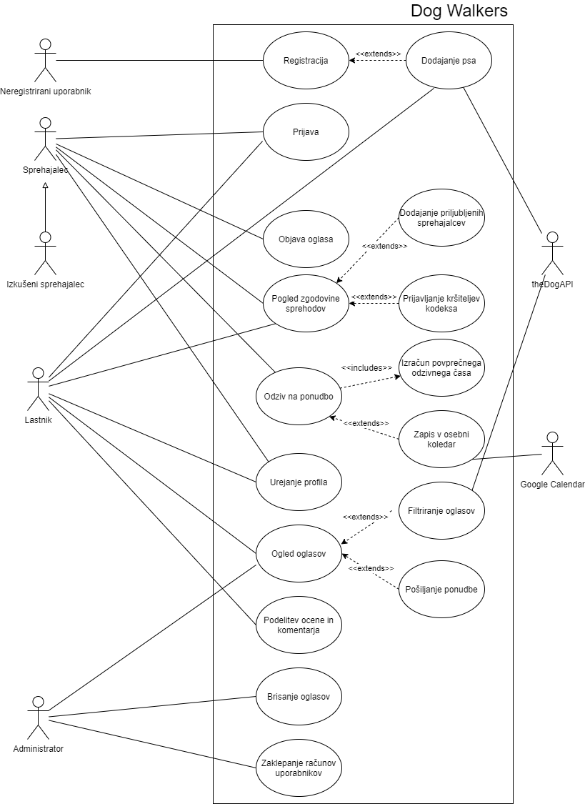
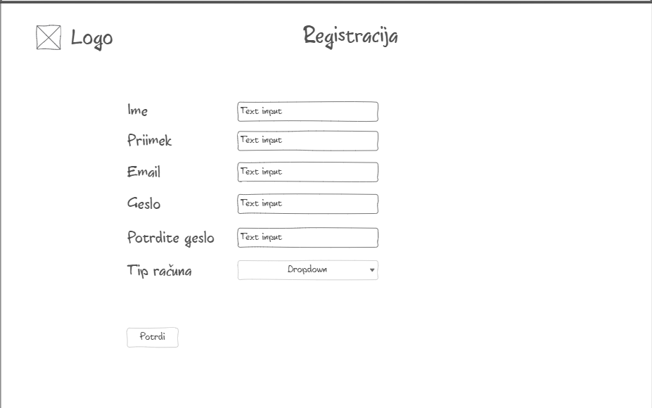
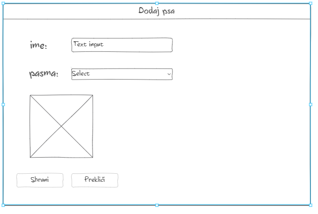
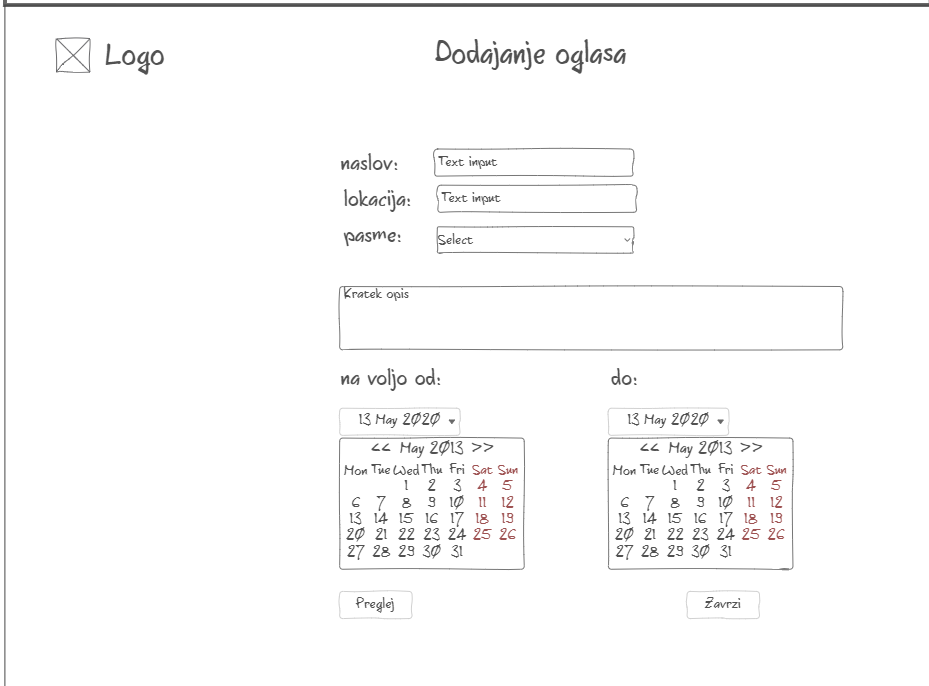
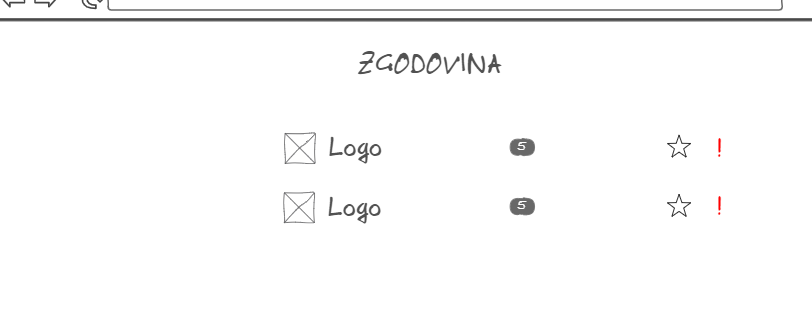
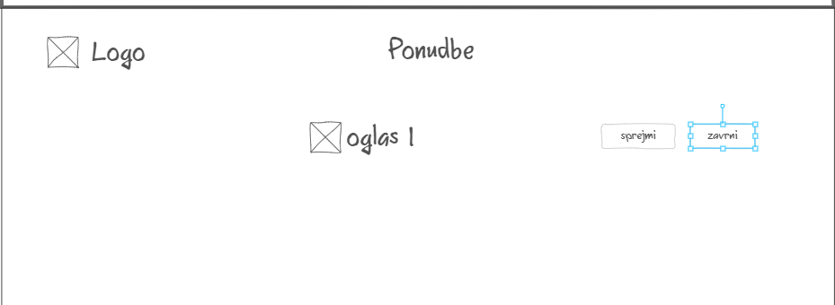
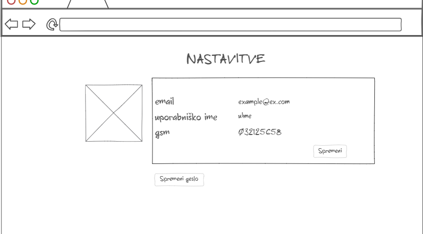
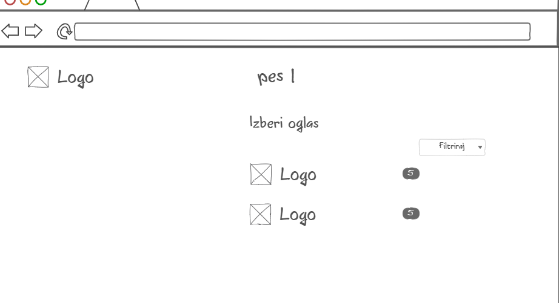
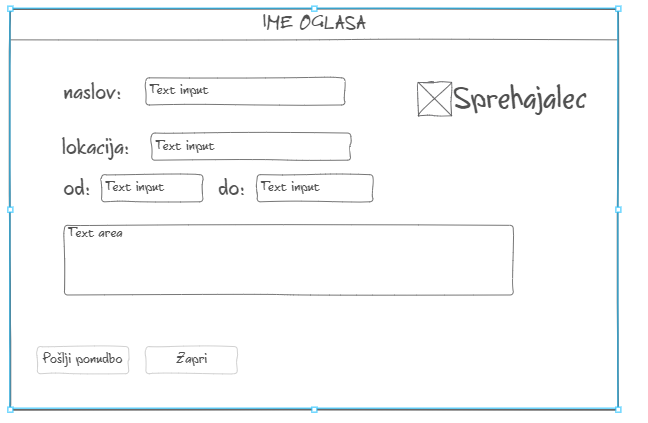
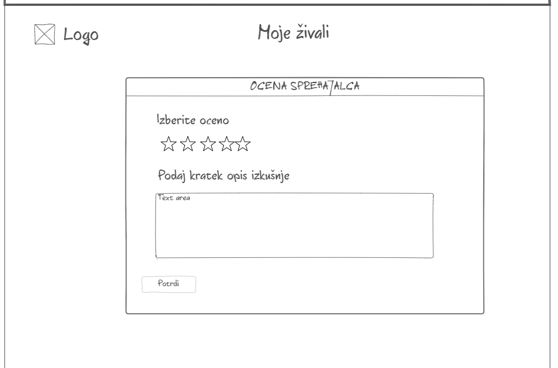

# Dokument zahtev

|                             |                                                         |
| :-------------------------- | :------------------------------------------------------ |
| **Naziv projekta**          | Dog Walkers                             |
| **Člani projektne skupine** | Martin Štrekelj, Mimi Klinec, Luka Bratina, Ilija Tavchioski, Tim Draksler |
| **Kraj in datum**           | 5. 4. 2021                                   |

## Povzetek projekta

V spodnjem dokumentu je navedena specifikacija zahtev za Dog Walkers, interaktivno aplikacijo za povezovanje lastnikov psov in sprehajalcev. Glavna komponenta aplikacije bo iskalnik, ki bo filtriral po oglasih in pomagal lastnikom najti idealnega sprehajalca za svojega najboljšega prijatelja. Lastniku in sprehajalcu bo nato omogočena enostavna izmenjava kontakta in dogovora za nadaljne sodelovanje. Aplikacija se bo preko zunanjega vmesnika Google Calendar povezovala tudi z uporabnikovim osebnim koledarjem, kar bo pripomoglo k upoštevanju terminov. Povezana bo tudi z vmesnikom theDogApi, ki po ponujal splošne informacije o pasmah. V dokumentu so zapisane vse funkcionalne in nefunkcionalne zahteve aplikacije, diagrami primerov uporabe ter osnutki zaslonskih mask.

## 1. Uvod

**Kateri problem bo naša aplikacija reševala?**

Aplikacija Dog Walkers je namenjena lastnikom psov in vsem ljubiteljem živali, ki se želijo občasno ukvarjati z njimi. Skrb za hišnega ljubljenčka namreč zahteva veliko časa in lastnik se bo slej ko prej znašel v situaciji, ko bo potreboval pomoč. Z uporabo te aplikacija jo bo enostavno našel, saj se bo lahko povezal z ljudmi, ki imajo veselje do živali in so zainteresirani za krajšo oskrbo oziroma sprehajanje psov.

Z aplikacijo torej želimo razbremeniti lastnike psov in jim pomagati kar se da enostavno najti primerno pomoč pri oskrbi njihovih ljubljenčkov. Po drugi strani želimo tudi omogočiti preživljanje časa s pasjimi ljubljenčki nelastnikom, ki jih to veseli.

**Kaj vse bo aplikacija počela?**

Za uporabo ostalih funkcionalnosti aplikacije se mora neregistriran uporabnik najprej registrirati v sistem. Pri tem lahko izbira med registracijo kot lastnik ali kot sprehajalec. Glede na izbiro ima po registraciji pri uporabi aplikacije na voljo različne funkcionalnosti. Uporabnik se lahko po registraciji prijavlja v sistem, kjer ima omogočeno urejanje svojega profila.

Sprehajalec ima poleg tega na voljo tudi možnost objavljanja oglasov, istočasno največ pet. V oglasih napiše kdaj je časovno na voljo za sprehajanje psa, poda lokacijo in po želji še preference glede pasme psa, za katere bi bil pripravljen skrbeti.

Oglasi sprehajalcev so namenjeni lastnikom. Ti imajo na voljo možnost prikaza oglasov, ki se jim razvrstijo glede na priporočilni sistem. Sem je vključen povprečni odzivni čas sprehajalca (hitreje kot se odzove na ponudbe, višje je uvrščen), morebitne prijave kršitev (če ima prijavljene kršitve se uvrsti nižje) in višina ocene sprehajalca (višje kot je ocenjen, višje se uvrsti). Lastnik ima omogočeno tudi filtriranje med oglasi. Parametre filtra sestavljajo lokacija, čas termina in pasma psa, ki je lahko specificirana v oglasu. Poleg tega si lahko tudi označi najljubše sprehajalce.

Lastnik lahko po ogledovanju oglasov izbranim pošlje ponudbo za sprehod. Sprehajalca, ki mu je bila poslana ponudba, aplikacija o tem obvesti. Sprehajalec lahko ponudbo sprejme ali zavrne. Če jo zavrne, sistem to sporoči lastniku. Če ponudbo sprejme, se s pritrdilnim odgovorom lastniku posreduje tudi kontakt sprehajalca in obema se termin preko zunanjega vmesnika Google Calendar zapiše v osebni koledar. Tako lahko lastnik in sprehajalec, ki sta izbrala skupni termin, navežeta stik in se dogovorita za vse ostale podrobnosti.

Lastniki imajo tudi možnost ocenjevanja sprehajalcev. Ko se sprehod, za katerega sta se lastnik in sprehajalec dogovorila, izteče, je lastnik pozvan k obvezni podaji ocene. Dokler je ne poda, ne more nadaljevati z uporabo aplikacije. Opcijsko lahko doda tudi komentar.

Ob povprečni oceni vsaj štiri in dovolj hitrem odzivnem času, se sprehajalec lahko nadgradi v izkušenega sprehajalca. Ta ima poleg vseh funkcionalnosti, ki so na voljo sprehajalcu, možnost objavljanja neomejenega števila oglasov.

Ker želimo zagotoviti kar se da pozitivno in varno uporabo aplikacije, ima uporabnik ob morebitnih incidentih tudi možnost prijave kršitev. S tem namenom obstaja še uporabniška vloga administratorja. Ta si pridržuje pravico, da lahko briše oglase sprehajalcev in uporabniku, glede na resnost in količino prijav, začasno zaklene račun.

**Kaj pa nefunkcionalne zahteve aplikacije?**

Pri aplikaciji Dolg Walkers se pričakuje izpolnitev še nekaj nefunkcionalnih zahtev. Aplikacija mora biti podprta na modernih brskalnikih in ne sme zahtevati nikakršnega nalaganja s strani odjemalca. Ob čakanju in nalaganju mora o tem jasno obvestiti uporabnika. Sistem uporabniku ne sme omogočiti dostopa do kontaktnih podatkov, za katere ni izrecno pooblaščen in pričakuje se uporabniški vmesnik prilagodljiv mobilnim napravam. Aplikacija mora biti vedno na voljo, z največjim dopustnim časom nedelovanja 5 sekund. Zahteva se zagotavljanje pristnosti uporabnikov z uporabo OTP potrdila pri registraciji uporabniškega računa. Razvoj zalednega sistema bo potekal v okolju Node.js, uporabniški vmesnik pa bo zgrajen iz ponovno uporabnih komponent. Aplikacija mora biti skladna s standardom WCAQ 2.1 in pri zbiranju uporabniških podatkov upoštevati zakon o varstvu osebnih podatkov. Kodeks aplikacije se ravna po Zakonu o zaščiti živali (ZZZiv).

## 2. Uporabniške vloge

- **lastnik** (lahko ureja svoj profil, si ogleduje in filtrira po oglasih sprehajalcev, si označi najljubše sprehajalce, pošilja ponudbe in vnaša ocene sprehajalcem, pregleduje zgodovino sprehodov in prijavlja kršitve)
- **sprehajalec** (lahko objavi največ 5 oglasov in jih ureja, ureja svoj profil, vnaša ocene in komentarje lastnikom, pregleduje zgodovino sprehodov ter prijavlja kršitve)
- **neregistriran uporabnik** (lahko se registrira v sistem)
- **administrator** (lahko izbriše oglase in odstrani uporabnike iz aplikacije)
- **izkušen sprehajalec** (lahko uporablja vse funkcionalnosti kot sprehajalec, a nima omejenega števila oglasov, ki jih lahko objavi)

## 3. Slovar pojmov

| Termin      | Opredelitev                                                                                                                                |
|-------------|--------------------------------------------------------------------------------------------------------------------------------------------|
| Uporabnik   | Uporabnik je vsak registriran uporabnik v aplikaciji. Uporabnik lahko nastopa v vlogi lastnika, sprehajalca ali izkušenega sprehajalca.                            |
| Lastnik     | Uporabnik z vlogo lastnik je uporabnik, ki ima na svojem profilu poleg svojih informacij, tudi informacije o svojem psu.                   |
| Sprehajalec | Uporabnik z vlogo sprehajalec je uporabnik, ki objavlja oglase.                                                                             |
| Komentar    | Komentar je tekstovni zapis, ki ga lastnik lahko podeli sprehajalcu po opravljenem sprehodu.                                               |
| Ocena       | Ocena je celoštevilčno število na intervalu 1 - 5, ki ga lastnik obvezno podeli sprehajalcu po opravljenem sprehodu.                         |
| Oglas       | Oglas je zbirka informacij o sprehajalcu, prostem terminu, priljubljene pasme in lokaciji, ki jo objavi sprehajalec v želji, da prejme ponudbo s strani lastnika. |
| Ponudba     | Ponudba je obvestilo, ki ga prejme sprehajalec, ko se na njegov oglas odzove lastnik. Ponudbo lahko sprehajalec sprejme ali zavrne.        |
| Sprehod     | Sprehod je dogovorjen termin, ko sprehajalec skrbi za lastnikovega psa.                                                              |
| Profil      | Profil uporabnika je zbirka nastavitev, informacij in vlog, povezanih z uporabnikom.                                                        |
| Kodeks      | Je seznam pravil in načina obnašanja, ki jih vsak novo registrirani uporabnik prebere in sprejme. Kršitve kodeksa se kaznuje z začasno zaklenitvijo računa.                                                                                                                                         |
|Priljubljen sprehajalec | Je sprehajalec, ki ga lastnik označi za priljubljenega. |
|Kršitelj                         | Je uporabnik, ki ima več prijav kršitve kodeksa s strani različnih uporabnikov |
| Iskalnik | Osrednja komponenta aplikacije, kjer lastniki iščejo primerne oglase |

## 4. Diagram primerov uporabe

## 5. Funkcionalne zahteve

### Registracija

#### Povzetek funkcionalnosti
Neregistriran uporabnik ima možnost registracije in s tem pridobi več funkcionalnosti aplikacije. Pri registraciji uporabi svoj e-poštni naslov in geslo.

#### Osnovni tok
1. Neregistriran uporabnik izbere funkcionalnost registracija.
2. Sistem mu prikaže registracijski obrazec.
3. Neregistriran uporabnik v registracijski obrazec vpiše svoje ime, priimek, e-poštni naslov in geslo, ki ga je potrebno vpisati dvakrat. Izbere tudi katere vrste uporabnik bo - lastnik psov ali sprehajalec psov. 
4. Neregistriran uporabnik izbere da bo sprehajalec psov.
5. Neregistriran uporabnik odda registracijski obrazec.
6. Sistem preveri če je geslo dolgo vsaj osem znakov, ter če vsebuje vsaj eno veliko črko.
7. Sistem registriranemu uporabniku na e-poštni naslov pošlje sporočilo za potrditev registracije.
8. Neregistriran uporabnik preko svoje e-pošte potrdi registracijo.
9. Sistem prikaže sporočilo o uspešni registraciji.

#### Alternativni tok

**Alternativni tok 1**
1. Neregistriran uporabnik izbere funkcionalnost registracija.
2. Sistem mu prikaže registracijski obrazec.
3. Neregistriran uporabnik v registracijski obrazec vpiše svoje ime, priimek, e-poštni naslov in geslo, ki ga je potrebno vpisati dvakrat. Izbere tudi katere vrste uporabnik bo - lastnik psov ali sprehajalec psov. 
4. Neregistriran uporabnik izbere da bo lastnik psov.
5. Sistem prikaže tri nova tekstovna polja: pasma, starost in opis.
6. Neregistriran uporabnik izpolne vsa tri polja s podatki o svojem psu.
7. Neregistriran uporabnik odda registracijski obrazec.
8. Sistem preveri če je geslo dolgo vsaj osem znakov, ter če vsebuje vsaj eno veliko črko.
9. Sistem registriranemu uporabniku na e-poštni naslov pošlje sporočilo za potrditev registracije.
10. Neregistriran uporabnik preko svoje e-pošte potrdi registracijo.
11. Sistem prikaže sporočilo o uspešni registraciji.

**Alternativni tok 2**
1. Neregistriran uporabnik želi uporabiti funkcionalnost, ki je na voljo zgolj registriranim uporabnikom
2. Sistem prikaže sporočilo, ki neregistriranemu uporabniku pove, da funkcionalnost na voljo samo registriranim uporabnikom, ponudi mu tudi možnost preusmeritve na registracijo.
3. Neregistriran uporabnik izbere funkcionalnost registracija.
4. Sistem mu prikaže registracijski obrazec.
5. Neregistriran uporabnik v registracijski obrazec vpiše svoje e-poštni naslov in geslo, ki ga je potrebno vpisati dvakrat. Izbere tudi katere vrste uporabnik bo - lastnik psov ali sprehajalec psov. 
6. Neregistriran uporabnik odda registracijski obrazec.
7. Sistem preveri če je geslo dolgo vsaj osem znakov, ter če vsebuje vsaj eno veliko črko.
8. Sistem neregistriranemu uporabniku na e-poštni naslov pošlje sporočilo za potrditev registracije.
9. Neregistriran uporabnik preko svoje e-pošte potrdi registracijo.
10. Sistem prikaže sporočilo o uspešni registraciji.

#### Izjemni tok
**Izjemni tok 1**
* Neregistriran uporabnik se poskuša registrirati z geslom, ki ni dolgo vsaj osem znakov ali pa ne vsebuje vsaj ene velike črke. Sistem ga obvesti o zahtevah gesla.

**Izjemni tok 2**
* Neregistriran uporabnik se poskuša registiriati z e-poštnim naslovom, ki je že pripada drugemu uporabniku. Sistem ga obvesti, da je e-poštni naslov že zaseden.

**Izjemni tok 3**
* Neregistriran uporabnik se poskuša registrirati, pri tem ni izbral ali je lastnik ali sprehajalec psov. Sistem ga obvesti, da mora izbrati nekaj od dveh možnosti.

#### Pogoji
* Uporabnik ne sme biti prijavljen, če je prijavljen mu ta funkcionalnost ni na voljo.

#### Posledice
* Če se celoten postopek izvede brez napak, je sedaj uporabnik zabeležen v sistemu in se lahko v aplikacijo prijavi.

#### Posebnosti
Podatki o registraciji se pošiljajo po varni povezavi

#### Prioritete identificiranih funkcionalnosti
MUST HAVE

#### Sprejemni testi
* **[Osnovni tok]** Neregistriran uporabnik se uspešno registrira kot sprehajalec, sedaj se lahko prijavi v sistem.
* **[Alternativni tok 1]** Neregistriran uporabnik se uspešno registrira kot lastnik, sedaj se lahko prijavi v sistem.
* **[Alternativni tok 2]** Neregistriran uporabnik izbere funkcionalnost, ki je na voljo zgolj registriranim uporabnikom. Sistem ga o tem obvesti in ga pozove k registraciji.
* **[Izjemi tok 1]** Neregistriran uporabnik pri registraciji vpiše neustrezno geslo.
* **[Izjemi tok 2]** Neregistriran uporabnik pri registraciji vpiše e-poštni naslov, ki je že v uporabi
* **[Izjemi tok 2]** Neregistriran uporabnik pri registraciji ne izbere ali je lastnik ali je sprehajalec psov.
 
-------------------

### Prijava

#### Povzetek funkcionalnosti
Lastnik, sprehajalec, izkušen sprehajalec ali administrator se lahko prijavijo v sistem.

#### Osnovni tok [Lastnik]
1. Lastnik izbere funkcionalnost prijava.
2. Sistem mu prikaže prijavni obrazec.
3. Lastnik izpolne obrazec s svojim e-poštnim naslovom in geslom.
4. Lastnik odda prijavni obrazec.
5. Sistem preveri pristnost vnešenih podatkov.
6. Lasnik je preusmerjen na domačo stran aplikacije.

#### Osnovni tok [Sprehajalec]
1. Sprehajalec izbere funkcionalnost prijava.
2. Sistem mu prikaže prijavni obrazec.
3. Sprehajalec izpolne obrazec s svojim e-poštnim naslovom in geslom.
4. Sprehajalec odda prijavni obrazec.
5. Sistem preveri pristnost vnešenih podatkov.
6. Sprehajalec je preusmerjen na domačo stran aplikacije.

#### Osnovni tok [Izkušen sprehajalec]
1. Izkušen sprehajalec izbere funkcionalnost prijava.
2. Sistem mu prikaže prijavni obrazec.
3. Izkušen sprehajalec izpolne obrazec s svojim e-poštnim naslovom in geslom.
4. Izkušen sprehajalec odda prijavni obrazec.
5. Sistem preveri pristnost vnešenih podatkov.
6. Izkušen sprehajalec je preusmerjen na domačo stran aplikacije.

#### Osnovni tok [Administrator]
1. Administrator izbere funkcionalnost prijava.
2. Sistem mu prikaže prijavni obrazec.
3. Administrator izpolne obrazec s svojim e-poštnim naslovom in geslom.
4. Administrator odda prijavni obrazec.
5. Sistem preveri pristnost vnešenih podatkov.
6. Administrator je preusmerjen na domačo stran aplikacije.

#### Izjemni tok
**Izjemni tok 1**
* Lastnik je za prijavo vnesel napačne podatke. Sistem zavrne prijavo in o tem obvesti lastnika.

**Izjemni tok 2**
* Sprehajalec je za prijavo vnesel napačne podatke. Sistem zavrne prijavo in o tem obvesti sprehajalca.

**Izjemni tok 3**
* Izkušen sprehajalec je za prijavo vnesel napačne podatke. Sistem zavrne prijavo in o tem obvesti izkušenega sprehajalca.

**Izjemni tok 4**
* Administrator je za prijavo vnesel napačne podatke. Sistem zavrne prijavo in o tem obvesti administratorja.
 
#### Pogoji
* V sistemu mora obstajati lastnik, sprehajalec, izkušen sprehajalec ali administrator v katerega se želi prijaviti uporabnik. 
* Da je prijava na voljo, trenutno ne sme biti prijavljen noben uporabnik.

#### Posledice
* Lastniku je po prijavi na voljo:
    - prikaz oglasov sprehajalcev in filtriranje po njih
    - pošiljanje ponudbe za sprehod
    - urejanje profila
    - pregled preteklih sprehodov
* Sprehajalcu je po prijavi na voljo:
    - objava oglasa za sprehajanje(največ pet oglasov)
    - urejanje oglasa za sprehajanje
    - urejanje profila
* Izkušenemu sprehajalcu je po prijavi na voljo:
    - objava oglasa za sprehajanje(neomejeno oglasov)
    - urejanje oglasa za sprehajanje
    - urejanje profila
* Administratorju je po prijavi na voljo:
    - brisanje oglasov
    - zaklepanje uporabnikov

#### Posebnosti
Podatki o prijavi se pošiljajo po varni povezavi

#### Prioritete identificiranih funkcionalnosti
MUST HAVE

#### Sprejemni testi
* **[Osnovni tok [Lastnik]]** Lastnik vnese pravilne podatke v prijavni obrazec, sistem ga prijavi in preusmeri na domačo stran aplikacije.
* **[Osnovni tok [Sprehajalec]]** Sprehajalec vnese pravilne podatke v prijavni obrazec, sistem ga prijavi in preusmeri na domačo stran aplikacije.
* **[Osnovni tok [Izkušen sprehajalec]]** Izkušen sprehajalec vnese pravilne podatke v prijavni obrazec, sistem ga prijavi in preusmeri na domačo stran aplikacije.
* **[Osnovni tok [Administrator]]** Administrator vnese pravilne podatke v prijavni obrazec, sistem ga prijavi in preusmeri na domačo stran aplikacije.
* **[Izjemni tok 1]** Lastnik v prijavni obrazec vnese napačen e-poštni naslov ali geslo. Sistem ga o tem obvesti in zavrne poskus prijave.
* **[Izjemni tok 2]** Sprehajalec v prijavni obrazec vnese napačen e-poštni naslov ali geslo. Sistem ga o tem obvesti in zavrne poskus prijave.
* **[Izjemni tok 2]** Izkušen sprehajalec v prijavni obrazec vnese napačen e-poštni naslov ali geslo. Sistem ga o tem obvesti in zavrne poskus prijave.
* **[Izjemni tok 3]** Administrator v prijavni obrazec vnese napačen e-poštni naslov ali geslo. Sistem ga o tem obvesti in zavrne poskus prijave.

-------------------

### Pošiljanje ponudbe za sprehod

#### Povzetek funkcionalnosti
Lastnik lahko sprehajalcu pošlje ponudbo za sprehajanje svojega psa.

#### Osnovni tok
1. Lastnik izbere funkcijo pošiljanja ponudbe za sprehod.
2. Sistem lastnika vpraša za potrditev pošiljanja ponudbe za sprehod.
3. Lastnik potrdi pošiljanje ponudbe za sprehod.
4. Sistem sprehajalcu pošlje ponudbo lastnika.

#### Izjemni tok
**Izjemni tok 1**
* Lastnik ne potrdi pošiljanja ponudbe za sprehod.

#### Pogoji
* V sistem je prijavljen lastnik.
* Lastnik se mora nahajati na nekem oglasu sprehajalca.

#### Posledice
* Po uspešnem pošiljanju ponudbe, se sprehajalcu omogoči funkcionalnost potrdtive ali zavrnitve te ponudbe.

#### Posebnosti
...

#### Prioritete identificiranih funkcionalnosti
MUST HAVE

#### Sprejemni testi
* **[Osnovni tok]** Prijavi se kot lastnik, izberi oglas sprehajalca, izberi pošiljanje ponudbe za sprehajanje, potrdi pošiljanje ponudbe.
* **[Izjemni tok 1]** Prijavi se kot lastnik, izberi oglas sprehajalca, izberi pošiljanje ponudbe za sprehajanje, ne potrdi pošiljanja ponudbe.

-------------------

### Odziv na ponudbo sprehajanja psa

#### Povzetek funkcionalnosti
Sprehajalec ali izkušen sprehajalec lahko potrdi ali zavrne ponudbo za sprehajanje psa

#### Osnovni tok[Sprehajalec]
1. Sprehajalec izbere ponudbo za sprehajanje psa.
2. Sprehajalec ponudbo sprejme.
3. Sistem o sprejeti ponudbi obvesti lastnika.

#### Osnovni tok[Izkušen sprehajalec]
1. Izkušen sprehajalec izbere ponudbo za sprehajanje psa.
2. Izkušen sprehajalec ponudbo sprejme.
3. Sistem o sprejeti ponudbi obvesti lastnika.

#### Alternativni tok
**Alternativni tok 1[Sprehajalec]**
1. Sprehajalec izbere ponudbo za sprehajanje psa.
2. Sprehajalec ponudno zavrne.
3. Sistem o zavrnjeni ponudbi obvesti lastnika.

**Alternativni tok 1[Izkušen sprehajalec]]**
1. Izkušen sprehajalec izbere ponudbo za sprehajanje psa.
2. Izkušen sprehajalec ponudno zavrne.
3. Sistem o zavrnjeni ponudbi obvesti lastnika.

#### Izjemni tok
**Izjemni tok 1**
* Sprehajalec se ne odzove na ponudbo in ta sedaj ni več veljavna. Sistem ponudbo izbriše iz seznama ponudb poslanih sprehajalcu.

**Izjemni tok 1**
* Izkušen sprehajalec se ne odzove na ponudbo in ta sedaj ni več veljavna. Sistem ponudbo izbriše iz seznama ponudb poslanih izkušenemu sprehajalcu.

#### Pogoji
* V sistem je prijavljen sprehajalec ali izkušen sprehajalec.
* Uporabnik se mora nahajati na seznamu ponudb ki so mu bile poslane.

#### Posledice
* Potrditev oziroma zavrnitev ponudbe sistem sporoči lastniku.

#### Posebnosti

#### Prioritete identificiranih funkcionalnosti
MUST HAVE
#### Sprejemni testi
* **[Osnovni tok[Sprehajalec]]** Prijavi se kot sprehajalec, izberi ponudbo ki ti je bila poslana, potrdi ponudbo.
* **[Osnovni tok[Izkušen sprehajalec]]** Prijavi se kot izkušen sprehajalec, izberi ponudbo ki ti je bila poslana, potrdi ponudbo.
* **[Alternativni tok 1[Sprehajalec]]** Prijavi se kot sprehajalec, izberi ponudbo ki ti je bila poslana, zavrni ponudbo.
* **[Alternativni tok 1[Izkušen sprehajalec]]** Prijavi se kot izkušen sprehajalec, izberi ponudbo ki ti je bila poslana, zavrni ponudbo.
* **[Izjemni tok 1]** Sprehajalec se ne odzove na ponudbo.
* **[Izjemni tok 2]** Izkušen sprehajalec se ne odzove na ponudbo.

-------------------

### Objava oglasa

#### Povzetek funkcionalnosti
Sprehajalec ali izkušen sprehajalec lahko objavi oglas, oglasu nastavi lokacijo in čas ko bo na voljo. Sprehajalec lahko objavi največ 5 oglasov, izkušen sprehajalec te omejitve nima.

#### Osnovni tok[Sprehajalec]
1. Sprehajalec izbere funkcionalnost objave oglasa.
2. Sistem prikaže obrazec za objavo oglasa.
3. Sprehajalec izpolni obrazec s časom in lokacijo ko bo na voljo.
4. Sprehajalec potrdi oddajo obrazca.
5. Sistem v bazo shrani oglas in njegove podatke.

#### Osnovni tok[Izkušen sprehajalec]
1. Izkušen sprehajalec izbere funkcionalnost objave oglasa.
2. Sistem prikaže obrazec za objavo oglasa.
3. Izkušen sprehajalec izpolni obrazec s časom in lokacijo ko bo na voljo.
4. Izkušen sprehajalec potrdi oddajo obrazca.
5. Sistem v bazo shrani oglas in njegove podatke.

#### Izjemni tok
**Izjemni tok 1**
* Sprehajalec želi objaviti oglas, vendar ga ne potrdi. Sistem ne shrani podatkov o oglasu.

**Izjemni tok 2**
* Izkušen sprehajalec želi objaviti oglas, vendar ga ne potrdi. Sistem ne shrani podatkov o oglasu.

#### Pogoji
* V sistem je prijavljen sprehajalec ali izkušen sprehajalec.

#### Posledice
* Če se funkcionalnost uspešno izvede, je v bazi zabeležen nov oglas. Ta oglas je sedaj viden vsem lastnikom.

#### Posebnosti

#### Prioritete identificiranih funkcionalnosti
MUST HAVE

#### Sprejemni testi
* **[Osnovni tok[Sprehajalec]]** Prijavi se kot sprehajalec, izberi ustvarjanje oglasa, potrdi objavo oglasa.
* **[Osnovni tok[Izkušen sprehajalec]]** Prijavi se kot izkušen sprehajalec, izberi ustvarjanje oglasa, potrdi objavo oglasa.
* **[Izjemni tok 1]** Prijavi se kot sprehajalec, izberi ustvarjanje oglasa, ne potrdi objave oglasa.
* **[Izjemni tok 2]** Prijavi se kot izkušen sprehajalec, izberi ustvarjanje oglasa, ne potrdi objave oglasa.

-------------------

### Urejanje oglasa

#### Povzetek funkcionalnosti
Sprehajalec ali izkušen sprehajalec lahko ureja svoj objavljen oglas. Spremeni lahko lokacijo in čas.

#### Osnovni tok[Sprehajalec]
1. Sprehajalec izbere funkcionalnost urejanja oglasa.
2. Sistem prikaže obrazec za urejanje oglas.
3. Sprehajalec spremeni lokacijo/čas, ki sta zapisana na oglasu.
4. Sprehajalec potrdi spremembo.
5. Sistem v bazo shrani posodobljene podatke o oglasu.

#### Osnovni tok[Izkušen sprehajalec]
1. Izkušen sprehajalec izbere funkcionalnost urejanja oglasa.
2. Sistem prikaže obrazec za urejanje oglas.
3. Izkušen sprehajalec spremeni lokacijo/čas, ki sta zapisana na oglasu.
4. Izkušen sprehajalec potrdi spremembo.
5. Sistem v bazo shrani posodobljene podatke o oglasu.

#### Izjemni tok
**Izjemni tok 1**
* Sprehajalec uredi oglas, vendar ga ne potrdi. Sistem ne shrani novih podatkov o oglasu.

**Izjemni tok 2**
* Izkušen sprehajalec uredi oglas, vendar ga ne potrdi. Sistem ne shrani novih podatkov o oglasu.

#### Pogoji
* V sistem je prijavljen sprehajalec ali izkušen sprehajalec.

#### Posledice
* Če se urejanje uspešno izvede, se v bazi nahajajo novi podatki o oglasu. Posodobljen oglas je viden vsem lastnikom.

#### Posebnosti

#### Prioritete identificiranih funkcionalnosti
SHOULD HAVE

#### Sprejemni testi
* **[Osnovni tok[Sprehajalec]]** Prijavi se kot sprehajalec, izberi urejanje oglasa, potrdi urejanje oglasa.
* **[Osnovni tok[Izkušen sprehajalec]]** Prijavi se kot izkušen sprehajalec, izberi urejanje oglasa, potrdi urejanje oglasa.
* **[Izjemni tok 1]** Prijavi se kot sprehajalec, izberi urejanje oglasa, ne potrdi urejanja oglasa.
* **[Izjemni tok 2]** Prijavi se kot izkušen sprehajalec, izberi urejanje oglasa, ne potrdi urejanja oglasa.

-------------------

### Urejanje profila

#### Povzetek funkcionalnosti
Lastnik, sprehajalec, izkušen sprehajalec ali administrator si lahko spremenijo uporabniško ime, telefonsko številko in geslo profila.

#### Osnovni tok [Lastnik]
1. Lastnik izbere funkcionalnost urejanje profila.
2. Sistem preusmeri lastnika na njegov profil.
3. Lastnik spremeni svoje geslo/telefonsko številko/uporabniško ime.
4. Lastnik klikne na gumb "Posodobi".
5. Sistem prikaže okence z gumboma "Potrdi" in "Prekliči" ter poljem, ki zahteva vnos trenutnega gesla.
6. Lastnik v polje vnese svoje trenutno geslo.
7. Lastnik klikne na gumb "Potrdi".
8. Sistem preveri pristnost vnešenega gesla.
9. Sistem v bazi spremeni podatke o lastniku.
10. Sistem zapre okno. 

#### Osnovni tok [Sprehajalec]
1. Sprehajalec izbere funkcionalnost urejanje profila.
2. Sistem preusmeri sprehajalca na njegov profil.
3. Sprehajalec spremeni svoje geslo/telefonsko številko/uporabniško ime.
4. Sprehajalec klikne na gumb "Posodobi".
5. Sistem prikaže okence z gumboma "Potrdi" in "Prekliči" ter poljem, ki zahteva vnos trenutnega gesla.
6. Sprehajalec v polje vnese svoje trenutno geslo.
7. Sprehajalec klikne na gumb "Potrdi".
8. Sistem preveri pristnost vnešenega gesla.
9. Sistem v bazi spremeni podatke o sprehajalcu.
10. Sistem zapre okno. 

#### Osnovni tok [Izkušen sprehajalec]
1. Izkušen sprehajalec izbere funkcionalnost urejanje profila.
2. Sistem preusmeri izkušenega sprehajalca na njegov profil.
3. Izkušen sprehajalec spremeni svoje geslo/telefonsko številko/uporabniško ime.
4. Izkušen sprehajalec klikne na gumb "Posodobi".
5. Sistem prikaže okence z gumboma "Potrdi" in "Prekliči" ter poljem, ki zahteva vnos trenutnega gesla.
6. Izkušen sprehajalec v polje vnese svoje trenutno geslo.
7. Izkušen sprehajalec klikne na gumb "Potrdi".
8. Sistem preveri pristnost vnešenega gesla.
9. Sistem v bazi spremeni podatke o izkušenem sprehajalcu.
10. Sistem zapre okno. 

#### Osnovni tok [Administrator]
1. Administrator izbere funkcionalnost urejanje profila.
2. Sistem preusmeri administratorja na njegov profil.
3. Administrator spremeni svoje geslo/telefonsko številko/uporabniško ime.
4. Administrator klikne na gumb "Posodobi".
5. Sistem prikaže okence z gumboma "Potrdi" in "Prekliči" ter poljem, ki zahteva vnos trenutnega gesla.
6. Administrator v polje vnese svoje trenutno geslo.
7. Administrator klikne na gumb "Potrdi".
8. Sistem preveri pristnost vnešenega gesla.
9. Sistem v bazi spremeni podatke o administratorju.
10. Sistem zapre okno. 

#### Alternativni tok
**Alternativni tok 1 [Lastnik]**
1. Lastnik izbere funkcionalnost urejanje profila.
2. Sistem preusmeri lastnika na njegov profil.
3. Lastnik spremeni svoje geslo/telefonsko številko/uporabniško ime.
4. Lastnik klikne na gumb "Posodobi".
5. Sistem prikaže okence z gumboma "Potrdi" in "Prekliči" ter poljem, ki zahteva vnos trenutnega gesla.
6. Lastnik klikne na gumb "Prekliči".
7. Sistem zapre okno. 
8. Sistem zavrže nove podatke.

**Alternativni tok 1 [Sprehajalec]**
1. Sprehajalec izbere funkcionalnost urejanje profila.
2. Sistem preusmeri sprehajalca na njegov profil.
3. Sprehajalec spremeni svoje geslo/telefonsko številko/uporabniško ime.
4. Sprehajalec klikne na gumb "Posodobi".
5. Sistem prikaže okence z gumboma "Potrdi" in "Prekliči" ter poljem, ki zahteva vnos trenutnega gesla.
6. Sprehajalec klikne na gumb "Prekliči".
7. Sistem zapre okno. 
8. Sistem zavrže nove podatke.

**Alternativni tok 1 [Izkušen sprehajalec]**
1. Izkušen sprehajalec izbere funkcionalnost urejanje profila.
2. Sistem preusmeri izkušenega sprehajalca na njegov profil.
3. Izkušen sprehajalec spremeni svoje geslo/telefonsko številko/uporabniško ime.
4. Izkušen sprehajalec klikne na gumb "Posodobi".
5. Sistem prikaže okence z gumboma "Potrdi" in "Prekliči" ter poljem, ki zahteva vnos trenutnega gesla.
6. Izkušen sprehajalec klikne na gumb "Prekliči".
7. Sistem zapre okno. 
8. Sistem zavrže nove podatke.

**Alternativni tok 1 [Administrator]**
1. Administrator izbere funkcionalnost urejanje profila.
2. Sistem preusmeri administratorja na njegov profil.
3. Administrator spremeni svoje geslo/telefonsko številko/uporabniško ime.
4. Administrator klikne na gumb "Posodobi".
5. Sistem prikaže okence z gumboma "Potrdi" in "Prekliči" ter poljem, ki zahteva vnos trenutnega gesla.
6. Administrator klikne na gumb "Prekliči"
7. Sistem zapre okno. 
8. Sistem zavrže nove podatke.

#### Izjemni tok
**Izjemni tok 1**
* Lastnik pri potrjevanju vtipka napačno geslo, sistem ga o tem obvesti in prosi naj vnese pravilno geslo.

**Izjemni tok 2**
* Sprehajalec pri potrjevanju vtipka napačno geslo, sistem ga o tem obvesti in prosi naj vnese pravilno geslo.

**Izjemni tok 3**
* Izkušen sprehajalec pri potrjevanju vtipka napačno geslo, sistem ga o tem obvesti in prosi naj vnese pravilno geslo.

**Izjemni tok 4**
* Administrator pri potrjevanju vtipka napačno geslo, sistem ga o tem obvesti in prosi naj vnese pravilno geslo.

#### Pogoji
* V sistem mora biti prijavljen lastnik, sprehajalec ali administrator.

#### Posledice
* Sistem posodobi podatke o lastniku, sprehajalcu ali administratorju,

#### Posebnosti

#### Prioritete identificiranih funkcionalnosti
SHOULD HAVE
#### Sprejemni testi
* **[Osnovni tok [Lastnik]]** Prijavi se kot lastnik, izberi urejanje profila, spremeni podatke, klikni na gumb "Posodobi", vnesi trenutno geslo, klikni na gumb "Potrdi".
* **[Osnovni tok [Sprehajalec]]** Prijavi se kot sprehajalec, izberi urejanje profila, spremeni podatke, klikni na gumb "Posodobi", vnesi trenutno geslo, klikni na gumb "Potrdi".
* **[Osnovni tok [Izkušen sprehajalec]]** Prijavi se kot izkušen sprehajalec, izberi urejanje profila, spremeni podatke, klikni na gumb "Posodobi", vnesi trenutno geslo, klikni na gumb "Potrdi".
* **[Osnovni tok [Administrator]]** Prijavi se kot administrator, izberi urejanje profila, spremeni podatke, klikni na gumb "Posodobi", vnesi trenutno geslo, klikni na gumb "Potrdi".
* **[Alternativni tok 1[Lastnik]]** Prijavi se kot lastnik, izberi urejanje profila, spremeni podatke, klikni na gumb "Posodobi", klikni na gumb "Prekliči".
* **[Alternativni tok 1[Sprehajalec]]** Prijavi se kot sprehajalec, izberi urejanje profila, spremeni podatke, klikni na gumb "Posodobi", klikni na gumb "Prekliči".
* **[Alternativni tok 1[Izkušen sprehajalec]]** Prijavi se kot izkušen sprehajalec, izberi urejanje profila, spremeni podatke, klikni na gumb "Posodobi", klikni na gumb "Prekliči".
* **[Alternativni tok 1[Administrator]]** Prijavi se kot administrator, izberi urejanje profila, spremeni podatke, klikni na gumb "Posodobi", klikni na gumb "Prekliči".
* **[Izjemni tok 1]** Prijavi se kot lastnik, izberi urejanje profila, spremeni podatke, klikni na gumb "Posodobi", vnesi napačno geslo, klikni na gumb "Potrdi".
* **[Izjemni tok 2]** Prijavi se kot sprehajalec, izberi urejanje profila, spremeni podatke, klikni na gumb "Posodobi", vnesi napačno geslo, klikni na gumb "Potrdi"
* **[Izjemni tok 3]** Prijavi se kot izkušen sprehajalec, izberi urejanje profila, spremeni podatke, klikni na gumb "Posodobi", vnesi napačno geslo, klikni na gumb "Potrdi"
* **[Izjemni tok 4]** Prijavi se kot administrator, izberi urejanje profila, spremeni podatke, klikni na gumb "Posodobi", vnesi napačno geslo, klikni na gumb "Potrdi".

-------------------

### Ocenjevanje sprehajalca

#### Povzetek funkcionalnosti
Lastnik mora podati oceno sprehajalcu ob končanem sprehodu.

#### Osnovni tok
1. Sistem prikaže okence v katerem mora lastnik podati oceno sprehajalcu.
2. Lastnik izbere oceno od ena do pet.
3. Lastnik klikne na gumb "Potrdi".
4. Sistem zabeleži oceno.
5. Sistem izračuna in shrani novo povprečno oceno sprehajalca.

#### Izjemni tok
**Izjemni tok 1**
* Lastnik pozabi potrditi vnos ocene. Sistem si ne zabeleži nove ocene.

**Izjemni tok 2**
* Lastnik ne izbere nobene ocene in želi potrditi vnos. Sistem ga obvesti, da ni izbral nobene ocene.

#### Pogoji
* V sistem je prijavljen lastnik.
* Končan je vsaj en sprehod.

#### Posledice
* Sistem v bazo shrani novo oceno o sprehajalcu in ponovno izračuna povprečje vseh ocen sprehajalca.

#### Posebnosti

#### Prioritete identificiranih funkcionalnosti
SHOULD HAVE

#### Sprejemni testi
* **[Osnovni tok]** Prijavi se kot lastnik, izberi funkcionalnost ocenjevanje sprehajalca, vnesi oceno, klikni na gumb "Potrdi".
* **[Izjemni tok 1]** Prijavi se kot lastnik, izberi funkcionalnost ocenjevanje sprehajalca, vnesi oceno, ne potrdi vnosa.
* **[Izjemni tok 2]** Prijavi se kot lastnik, izberi funkcionalnost ocenjevanje sprehajalca, klikni na gumb "Potrdi".

-------------------

### Ogled preteklih sprehodov

#### Povzetek funkcionalnosti
Lastnik, sprehajalec ali izkušen sprehajalec lahko pregledujejo svoje pretekle sprehode. Lastnik ima omogočeno še dodajanje sprehajalca k priljubljenim in prijavo sprehajalca za kršenje kodeksa aplikacije.

#### Osnovni tok [Lastnik]
1. Lastnik izbere funkcionalnost za ogled preteklih sprehodov.
2. Sistem lastnika preusmeri na stran s seznamom vseh preteklih sprehodov.
3. Lastnik klikne na nek pretekli sprehod.
4. Sistem lastniku prikaže podrobnosti o izbranem sprehodu(lokacijo, čas in sprehajalca).
5. Lastnik lahko iz tu začne funkcionalnosti "Prijava kršitve kodeksa aplikacije" ali "Označitev najljubših sprehajalcev"

#### Osnovni tok [Sprehajalec]
1. Sprehajalec izbere funkcionalnost za ogled preteklih sprehodov.
2. Sistem sprehajalca preusmeri na stran s seznamom vseh preteklih sprehodov.
3. Sprehajalec klikne na nek pretekli sprehod.
4. Sistem sprehajalcu prikaže podrobnosti o izbranem sprehodu(lokacijo, čas in lastnika).

#### Osnovni tok [Izkušen sprehajalec]
1. Izkušen sprehajalec izbere funkcionalnost za ogled preteklih sprehodov.
2. Sistem izkušenega sprehajalca preusmeri na stran s seznamom vseh preteklih sprehodov.
3. Izkušen sprehajalec klikne na nek pretekli sprehod.
4. Sistem izkušenemu sprehajalcu prikaže podrobnosti o izbranem sprehodu(lokacijo, čas in lastnika).

#### Izjemni tok
**Izjemni tok 1**
* Lastnik nima preteklih sprehodov, seznam je prazen.

**Izjemni tok 2**
* Sprehajalec nima preteklih sprehodov, seznam je prazen.

**Izjemni tok 3**
* Izkušen sprehajalec nima preteklih sprehodov, seznam je prazen.

#### Pogoji
* V sistem je vpisan lastnik, sprehajalec ali izkušen sprehajalec.

#### Posledice
* Lastnik lahko iz seznama označi najljubše sprehajalce in izkušene sprehajalce, lahko pa tudi prijavi sprehajalce ali izkušene sprehajalce za kršenje kodeksa aplikacije.

#### Posebnosti

#### Prioritete identificiranih funkcionalnosti
SHOULD HAVE

#### Sprejemni testi
* **[Osnovni tok[Lastnik]]** Prijavi se kot lastnik, izberi funkcionalnost ogled preteklih sprehodov, izberi pretekli sprehod.
* **[Osnovni tok[Sprehajalec]]** Prijavi se kot sprehajalec, izberi funkcionalnost ogled preteklih sprehodov, izberi pretekli sprehod.
* **[Osnovni tok[Izkušen sprehajalec]]** Prijavi se kot izkušen sprehajalec, izberi funkcionalnost ogled preteklih sprehodov, izberi pretekli sprehod.
* **[Izjemni tok 1]** Prijavi se kot lastnik, izberi funkcionalnost ogled preteklih sprehodov, izberi pretekli sprehod.
* **[Izjemni tok 2]**  Prijavi se kot sprehajalec, izberi funkcionalnost ogled preteklih sprehodov, izberi pretekli sprehod.
* **[Izjemni tok 3]**  Prijavi se kot izkušen sprehajalec, izberi funkcionalnost ogled preteklih sprehodov, izberi pretekli sprehod.

-------------------

### Prijava kršitve kodeksa aplikacije

Lastnik lahko prijavi sprehajalca ali izkušenega sprehajalca zaradi kršitve kodeksa(pravil) aplikacije.

#### Povzetek funkcionalnosti

Če lastnik meni, da sprehajalec ali izkušen sprehajalec ni deloval v skladu s kodeksom aplikacije lahko prijavi sprehajalca.

#### Osnovni tok

1. Lastnik se vpiše v aplikacijo.
2. Lastnik v menujski vrstici izbere povezavo na pretekle sprehode.
3. V seznamu preteklih sprehodov izbere sprehajalca ali izkušenega sprehajalca za katerega je prepričan, da ne deluje v skladu s kodeksom aplikacije.
4. Ob kliku na gumb 'Prijavi kršitev kodeksa' se uporabniku odpre pogovorna vrstica, kjer mora izbrati kršitve, ki jih pripisuje sprehajalcu ali izkušenemu sprehajalcu.
5. Lastnik nato potrdi izbiro.
6. Sistem ga preusmeri nazaj na pretekle sprehode in ga obvesti o uspešni oddaji prijave.
7. Poleg imena prijavljenega kršitelja se prikaže zastavica ter onemogoči se gumb za ponovno prijavo kršitve.

#### Alternativni tok

1. Lastnik se vpiše v aplikacijo.
2. Lastnik v menujski vrstici izbere povezavo na pretekle sprehode.
3. V seznamu preteklih sprehodov izbere sprehajalca ali izkušenega sprehajalca za katerega je prepričan, da ne deluje v skladu s kodeksom aplikacije.
4. Ob kliku na gumb 'Prijavi kršitev kodeksa' se uporabniku odpre pogovorna vrstica, kjer mora izbrati kršitve, ki jih pripisuje sprehajalcu ali izkušenemu sprehajalcu.
5. Lastnik nato ovrže izbiro in zavrne prijavo kršitve.
6. Sistem ga preusmeri nazaj na pretekle sprehode in ga obvesti o opuščeni oddaji prijave.

#### Pogoji

Lastnik in sprehajalec ali izkušen sprehajalec morata imeti opravljen vsaj en skupen termin/sprehod.

#### Posledice

Če več različnih lastnikov prijavi istega sprehajalca ali izkušenega sprehajalca, se ob oglasih sprehajalca ali izkušenega sprehajalca pojavi rdeča zastavica.

#### Posebnosti

/

#### Prioritete identificiranih funkcionalnosti

WOULD HAVE

#### Sprejemni testi

* **[Osnovni tok]** Uporabniku sistem pokaže zastavico poleg imena kršitelja in ima omogočeno ponovno prijavo kršitve za istega sprehajalca ali izkušenega sprehajalca.
* **[Alternativni tok 1]** Uporabnik lahko ponovno odpre pogovorno okno za prijavo kršitve za istega sprehajalca ali izkušenega sprehajalca.

-------------------

### Označitev najljubših sprehajalcev

Lastnik lahko označi najljubše sprehajalce ali izkušene sprehajalce.

#### Povzetek funkcionalnosti

Lastnik lahko preko preteklih sprehodov označi svoje priljubljene sprehajalce ali izkušene sprehajalce. Po oznaki moji priljubljeni sprehajalci lahko lastnik filtrira po oglasih.

#### Osnovni tok

1. Lastnik se vpiše v aplikacijo.
2. Lastnik v menujski vrstici izbere povezavo na pretekle sprehode.
3. V seznamu preteklih sprehodov izbere sprehajalca ali izkušenega sprehajalca s katerim je bil zadovoljen.
4. Ob kliku na gumb 'Dodaj med priljubljene' se uporabniku odpre pogovorna vrstica, kjer lastnik lahko potrdi ali zavrne izbiro.
5. Lastnik nato potrdi izbiro.
6. Sistem ga preusmeri nazaj na pretekle sprehode in ga obvesti o uspešnem dodajanju sprehajalca med priljubljene.
7. Poleg imena priljubljenega sprehajalca se prikaže zvezdica, ki pomeni, da je sprehajalec med priljubljenimi.
8. Lastnik v menujski vrstici izbere povezavo na iskalnik oglasov.
9. Pri iskanju lahko označi 'Išči samo med priljubljenimi sprehajalci'.
10. Oglasi predhodno označenega priljubljenega sprehajalca so v zadetkih iskalnika.

#### Alternativni tok

1. Lastnik se vpiše v aplikacijo.
2. Lastnik v menujski vrstici izbere povezavo na pretekle sprehode.
3. V seznamu preteklih sprehodov izbere sprehajalca s katerim je bil zadovoljen.
4. Ob kliku na gumb 'Dodaj med priljubljene' se uporabniku odpre pogovorna vrstica, kjer lastnik lahko potrdi ali zavrne izbiro.
5. Lastnik nato zavrne izbiro.
6. Sistem ga preusmeri nazaj na pretekle sprehode in ga obvesti o opuščenem dodajanju sprehajalca med priljubljene.
7. Lastnik v menujski vrstici izbere povezavo na iskalnik oglasov.
8. Pri iskanju lastnik ne more označiti 'Išči samo med priljubljenimi sprehajalci'.

#### Pogoji

Lastnik in sprehajalec morata imeti opravljen vsaj en skupen termin/sprehod.
Če lastnika nima nobenega priljubljenega sprehajalca, je filter za iskanje po priljubljenih sprehajalcih onemogočen.

#### Posledice

Oglasi priljubljenega sprehajalca se prikazujejo med filtriranjem po priljubljenih sprehajalcih.

#### Posebnosti

/

#### Prioritete identificiranih funkcionalnosti

COULD HAVE.

#### Sprejemni testi

* **[Osnovni tok]** Uporabniku lahko filtrira v iskalniku po oglasih priljubljenih sprehajalcev.
* **[Alternativni tok 1]** Uporabniku ne more filtrirati v iskalniku po oglasih priljubljenih sprehajalcev.

-------------------

### Izbris neprimernih oglasov

#### Povzetek funkcionalnosti
Administrator lahko izbriše oglase sprehajalcev ali izkušenih sprehajalcev, ki kršijo pravila aplikacije.

#### Osnovni tok
1. Administrator izbere oglas, ki krši pravila aplikacije.
2. Sistem mu prikaže izbran oglas.
3. Administrator klikne na gumb "Izbris oglasa".
4. Sistem prikaže pojavno okno, ki sprašuje po potrditvi izbrisa.
5. Administrator klikne na gumb "Potrdi"
6. Sistem izbriše izbrani oglas iz baze podatkov.
7. Sistem administratorja obvesti o uspešnem brisanju oglasa.
8. Sistem zapre pojavno okno.

#### Izjemni tok
**Izjemni tok 1**
* Administrator ne potrdi izbrisa oglasa. Oglas se ne izbriše iz baze podatkov in se še vedno prikazuje drugim uporabnikom.

#### Pogoji
* V sistem je prijavljen administrator.
* Objavljen je vsaj en oglas.

#### Posledice
* Izbran oglas se izbriše iz baze podatkov in se neha prikazovati drugim uporabnikom.

#### Posebnosti

#### Prioritete identificiranih funkcionalnosti
COULD HAVE

#### Sprejemni testi
* **[Osnovni tok]** Prijavi se kot administrator, izberi si ogled oglasov, klikni na izbran oglas, klikni na gumb "Izbris oglasa", klikni na gumb "Potrdi".
* **[Izjemni tok 1]** Prijavi se kot administrator, izberi si ogled oglasov, klikni na izbran oglas, klikni na gumb "Izbris oglasa", ne potrdi izbrisa oglasa.

-------------------

### Zaklep računa kršiteljev

#### Povzetek funkcionalnosti
Administrator lahko zaklene račune sprehajalcev ali izkušenih sprehajalcev, ki so dobili zadostno število prijav za kršenje kodeksa aplikacije.

#### Osnovni tok
1. Administrator izbere profil sprehajalca z velikim številom prijav.
2. Sistem prikaže profil sprehajalca.
3. Administrator klikne na gumb "Zakleni uporabnika".
4. Sistem prikaže pojavno okno, ki sprašuje za potrditev.
5. Administrator klikne na gumb "Potrdi".
6. Sistem označi profil sprehajalca kot zaklenjenega.

#### Izjemni tok
**Izjemni tok 1**
* Administrator ne potrdi zaklepa uporabnika. Sprehajalec lahko še vedno uporablja svoj račun.

#### Pogoji
* V sistem je prijavljen administrator.
* Nek sprehajalec je zbral dovolj prijav za kršenje kodeksa aplikacije.

#### Posledice
* Sistem zaklene določenega sprehajalca, s tem se mu onemogoči vpis v aplikacijo.

#### Posebnosti

#### Prioritete identificiranih funkcionalnosti
WOULD HAVE
#### Sprejemni testi
* **[Osnovni tok]** Prijavi se kot administrator, izberi profil kršitelja, klikni na gumb "Zakleni uporabnika", klikni na gumb "Potrdi".
* **[Izjemni tok 1]** Prijavi se kot administrator, izberi profil kršitelja, klikni na gumb "Zakleni uporabnika", ne potrdi zaklepa.

-------------------

### Ogled vseh oglasov

#### Povzetek funkcionalnosti
Lastnik si lahko ogleda vse trenutno objavljene oglase.

#### Osnovni tok
1. Lastnik izbere funkcionalnost za ogled vseh oglasov.
2. Sistem prikaže seznam vseh trenutno objavljenih oglasov.

#### Izjemni tok
**Izjemni tok 1**
* Lastnik si želi ogledati vse oglase, vendar trenutno ni objavljen noben oglas. Sistem lastnika o tem obvesti.

#### Pogoji
* V sistem je prijavljen lastnik.
* Objavljen je vsaj en oglas.

#### Posledice
* Lastnik lahko odpira oglase in si ogleda njihove podrobnosti. Od tu lahko pošilja ponudbe za sprehod.

#### Posebnosti

#### Prioritete identificiranih funkcionalnosti
MUST HAVE

#### Sprejemni testi
* **[Osnovni tok]** Prijavi se kot lastnik, izberi ogled vseh oglasov.
* **[Alternativni tok 1]** Prijavi se kot lastnik, izberi ogled vseh oglasov.

-------------------

### Filtriranje oglasov

#### Povzetek funkcionalnosti
Lastnik lahko uporabi določene filtre po kateri se mu prikazujejo oglasi. Filtrira lahko po lokaciji, terminu, priljubljenih sprehajalcih in pasmi.

#### Osnovni tok
1. Lastnik izbere funkcionlanost za ogled vseh oglasov.
2. Sistem prikaže seznam vseh oglasov.
3. Lastnik si nastavi filtre po katerih si želi ogledati oglase.
4. Lastnik klikne na gumb "Uporabi filtre".
5. Sistem uporabi pridobljene filtre in uporabniku prikaže nov seznam oglasov.

#### Izjemni tok
**Izjemni tok 1**
* Lastnik vnese željene filtre, sistem ugotovi da noben oglas ne ustreza podanim filtrom, sistem obvesti uporabnika da trenutno ni na voljo noben oglas, ki bi ustrezal podanim filtrom.

#### Pogoji
* V sistem je prijavljen lastnik.

#### Posledice
* Lastniku se prikaže seznam oglasov, ki ustreza njegovim filtrom.

#### Posebnosti

#### Prioritete identificiranih funkcionalnosti
SHOULD HAVE

#### Sprejemni testi
* **[Osnovni tok]** Prijavi se kot lastnik, izberi ogled vseh oglasov, vnesi željene filtre, klikni na gumb "Uporabi filtre".
* **[Izjemni tok 1]** Prijavi se kot lastnik, izberi ogled vseh oglasov, vnesi željene filtre, klikni na gumb "Uporabi filtre".

-------------------

## 6. Nefunkcionalne zahteve

### Zahteve izdelka:
1. Aplikacija naj bo podprta na modernih brskalnikih IE, Firefox, Chrome in Safari od 2016 dalje.
2. Aplikacija naj ne zahteva nikakršnega nalaganja s strani odjemalca
3. Aplikacija naj ob čakanju in nalaganju o tem jasno obvesti uporabnika
4. Sistem uporabniku ne sme omogočiti dostopa do kontaktnih podatkov, za katere ni izrecno pooblaščen.
5. Uporabniški vmesnik naj bo prilagodljiv za mobilne naprave
6. Aplikacija naj bo vedno na voljo z največjo dopustnim časom ne delovanja 5 sekund.

### Organizacijske zahteve:
1. Aplikacija naj zagotovi pristnost uporabnikov s uporabo OTP potrdila pri registraciji uporabniškega računa
2. Zaledni sistem naj bo sprogramiran v okolju Node.JS
3. Uporabniški vmesnik naj bo zgrajen iz ponovno uporabnih komponent

### Zunanje zahteve:
1. Aplikacija naj pri zbiranju uporabniških podatkov upošteva GDPR
2. Aplikacija naj bo skladna s WCAQ 2.1 standardom. 
3. Kodeks aplikacije naj bo na podlagi Zakona o zaščiti živali (ZZZiv)

## 7. Prototipi vmesnikov

### Osnutki zaslonskih mask

#### Registracija

#### Prijava

#### Dodajanje psa

#### Objava oglasa

#### Pregled zgodovine sprehodov
Vključuje tudi dodajanje priljubljenih sprehajalcev in prijavljanje kršitev kodeksa

#### Odziv na ponudbo

#### Urejanje profila

#### Ogled oglasov
Vključuje tudi filtriranje oglasov

#### Pošiljanje ponudbe

#### Podelitev ocene in komentarja

### Vmesniki do zunanjih sistemov

#### TheDogAPI
Ob vsaki prijavi uporabnika se pošlje klic na api, ki vrne seznam pasm psov. Za vsako pasmo shranimo:
* id pasme
* ime pasme
Podatke o pasmah uporabimo kasneje v filtrih, dodajanju psov in dodajanjem oglasov.

#### Google Calendar
Aplikacija omogoča dodajanje dogodkov v koledar prek Google Calendar API.
Uporabi funkcijo events.insert(), kateri se poda:
* ID koledarja: V našem primeru 'primary', ki doda dogodek na primaren koledar uporabnika.
* dogodek: Podatki o imenu, začetku in koncu dogodka
